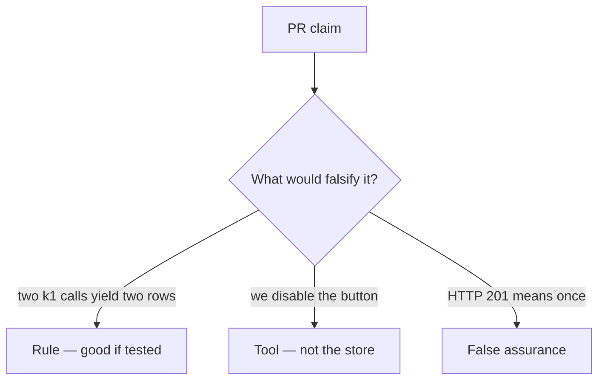

# Review of duplicate share inserts

**Kind:** code-review
**Loop step:** Review

## What you are reviewing

Review `labs/2.4/2.4-state-time/vulnerable/` as a change to notes-app share. Check whether a second `share_note` with `k1` still appends a row.

If `test_retry_does_not_duplicate_side_effect` still fails, “will add remembering later” is unfinished work.

## Picture: INSERT share on every POST

**INSERT share on every POST**.

The share count still has to stay under retry. A second call that forgets the first outcome still doubles the side effect.

## Problems to find (name them yourself)

- INSERT share on every POST
- Idempotency key in a log comment only
- Test only happy-path single click
- Fail open on idempotency store timeout

Also reject: treating the client as what you trust; an awareness-list name as the finding title; closing findings without re-running `test_retry_does_not_duplicate_side_effect`; keys in learner notes; live load tests against a public API; unique-on-`note_id` as if it were this rule.

## Common mix-ups

- Retries are a client bug, not ours
- HTTP 200 means once
- Databases automatically remember
- Disable-on-submit is the promise
- FastAPI or Next.js retries remember the share list
- An awareness-list name as the definition of the finding

## Use it somewhere new

Payment capture, invite token, or clinic last slot. A change that “handles the awareness list” without a replay test is an incomplete review. Name the independent falsehood that would still stop a second grant.

## Can people still use it

Disable-on-submit is not the rule. Accessible “still working” must not mint a new key.

## What this page is not doing

Someone still has to remember the first share outcome; “will add remembering later” does not do that.
