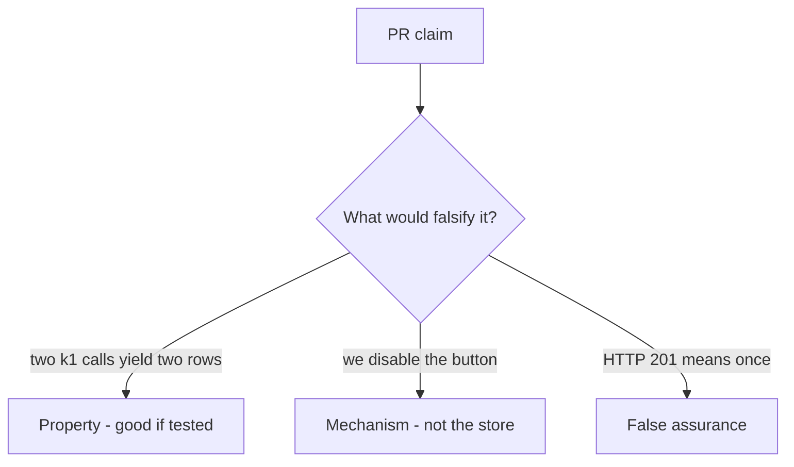

# 2.4-LO-08 — Review the duplicate share as a PR, not a slogan

**Kind:** code-review
**Loop step:** Review
**Standards:** RFC 9110 (final); OWASP ASVS 5.0.0 (final) `v5.0.0-2.3.3`; OWASP Top 10:2025 A10 as awareness only.

## Review the fixture as if it were SecureCollab share

Review `labs/2.4/2.4-state-time/vulnerable/` as a SecureCollab PR. Your job is not to count suspicious lines. Reconstruct whether a second `share_note` with `k1` still appends a row, compare that with the module invariant, and write changes a developer can verify.

Intended findings live only in `content/assessment/keys/2.4.md` — not here. Do not open the keys file until your review has been evaluated.

## Mental model: INSERT share on every POST

Start with this seeded smell: **INSERT share on every POST**. Label it property, mechanism, or false assurance before you accept the PR.

Classification starts at the protected effect (share count under retry). Everything that is not a remembered first outcome at that second call is a candidate ambient path.

## Seeded smells (label them yourself)

- INSERT share on every POST
- Idempotency key in a log comment only
- Test only happy-path single click
- Fail-open on idempotency store timeout

Also reject: client trust as the TCB; A10 as the finding title; closing findings without re-running `test_retry_does_not_duplicate_side_effect`; keys in learner notes; live load tests against a public API; unique-on-`note_id` as if it were this cell.

## Misconceptions this module refuses

- Retries are a client bug, not ours
- HTTP 200 means once
- Databases are automatically idempotent
- Disable-on-submit is the guarantee
- FastAPI or Next.js retries remember the share graph
- A10 as the definition of the finding

## Practice

Write three review notes a maintainer could act on. Each note: observation, property or false assurance, suggested structural change, residual you will **not** delete. Tie at least one to `test_retry_does_not_duplicate_side_effect`.

## Transfer

Payment capture, invite token, or clinic last slot. A PR that “handles A10” without a replay test is an incomplete mediation review. Name the independent falsehood that would still stop a second grant.

## HITL / WCAG 2.2

Disable-on-submit is not the property. Accessible “still working” must not mint a new key.

## Non-goals

Do not merge by adding a comment “will add idempotency later.” That comment is a residual without an owner.
