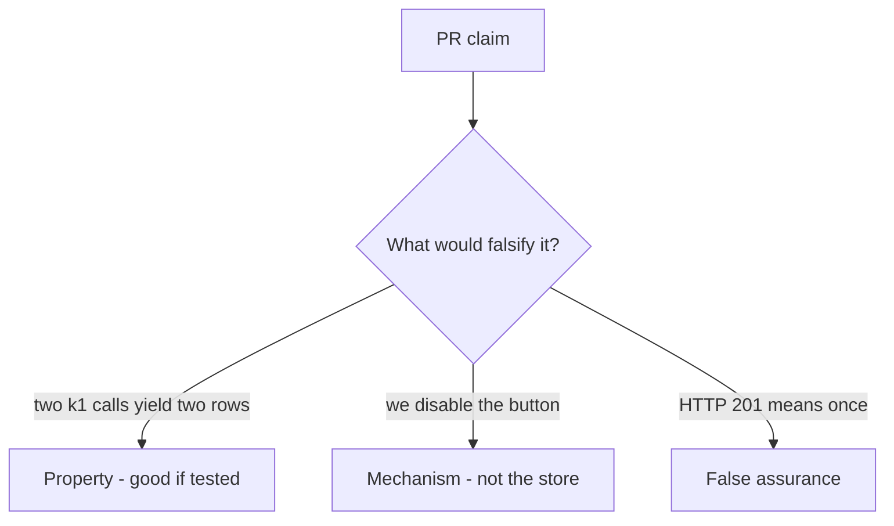

# 2.4-LO-08 — Review the duplicate share as a PR, not a slogan

**Kind:** code-review
**Loop step:** Review
**Standards:** RFC 9110 (final); OWASP Top 10:2025 A10 as awareness only.

## Review the fixture as if it were SecureCollab share

Review `labs/2.4/2.4-state-time/vulnerable/` as a SecureCollab PR. Intended findings live only in `content/assessment/keys/2.4.md` — not here.

## Mental model: INSERT share on every POST

Start with this seeded smell: **INSERT share on every POST**. Label it property, mechanism, or false assurance before you accept the PR.

Seeded smells (label them yourself; do not open the keys file):

- INSERT share on every POST
- Idempotency key in a log comment only
- Test only happy-path single click
- Fail-open on idempotency store timeout

Also reject: client trust, A10 as the finding title, closing findings without retest, keys in lessons, live load tests.

## Misconceptions

- Retries are a client bug not ours
- 200 means once
- Databases are automatically idempotent

## Practice

Write three review notes. Tie at least one to `test_retry_does_not_duplicate_side_effect`.

## Transfer

Payment, invite, or clinic slot. A PR that “handles A10” without a replay test is incomplete.

## HITL / WCAG 2.2

Disable-on-submit is not the property. Accessible “still working” must not mint a new key.
