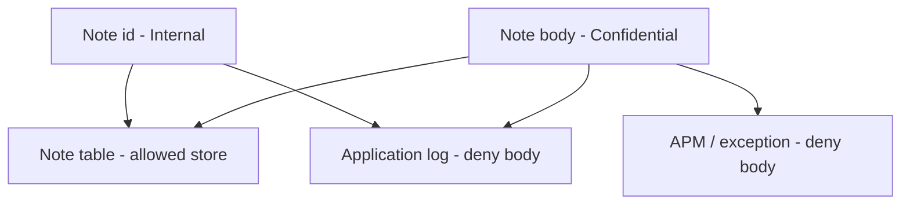
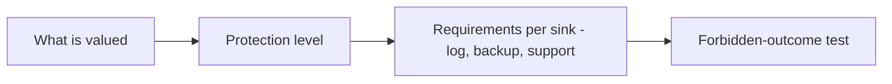

# 3.1-LO-01 — Classification is a sink rule, not a spreadsheet sticker

**Kind:** concept-model
**Loop step:** 1 Property
**Standards:** NIST CSF 2.0 (final) Identify as an *outcome family*, not a control catalogue; OWASP ASVS 5.0.0 (final) `v5.0.0-14.1.1`, `v5.0.0-14.1.2`, and `v5.0.0-16.2.5`; NIST Privacy Framework 1.0 (final) for privacy outcomes; Privacy Framework 1.1 remains a **draft** if cited.

## The claim this module owns

SecureCollab Phase 1 note **bodies** are Confidential. That word is empty until it names **which sinks** may hold the field. An application log line for `note_read` is a lower-trust store than the note table: operators, a SIEM vendor, and another tenant’s admin on shared observability may read it.

> For a SecureCollab Phase 1 `note_read` event, the log line must not contain the note body. It may contain allow-listed metadata (event name, note id, tenant id). Classification is a property of the **field** and of each sink. A Confluence label, a privacy policy, or `DEBUG=true` does not enforce this.

The forbidden outcome is **Confidential field in a lower-trust store**: `log_event("note_read", "tenant-A-secret-body")` includes `tenant-A-secret-body`. That is a 1.1 confidentiality and privacy failure.

ASVS `v5.0.0-14.1.1` wants sensitive data identified and classified. `v5.0.0-14.1.2` wants each protection level to say **how the data is logged**. `v5.0.0-16.2.5` wants logging to enforce that level (credentials never; other data hashed or masked). CSF Identify names the inventory outcome; it does not redact uvicorn.

## Mental model: field × sink



A sticker on the field that does not change the log API is theater. The TCB is the **logging API handlers actually call**, plus every other sink (print, f-string, exception `repr`, slow-query log, packet capture).

**Mechanism (not the property):** uvicorn access logs will store query strings (4.3). FastAPI does not know Confidential. A DLP product name is not this sentence.

## Mental model: inventory before redaction



If the inventory does not list the log drain, redaction of `logger.info` is incomplete. Operators still seeing **ids** is a different cell—document it; do not pretend ids are the body.

## Root cause vs impact vs prevention vs detection vs recovery

| Slice | For this property |
|---|---|
| Root cause | Body treated as debug context |
| Preconditions | Handler logs the event payload including the body |
| Trigger | `log_event` for `note_read` |
| Impact | Confidentiality and privacy of the body in a lower-trust store |
| Prevention | Structured logs with allow-listed fields; never interpolate the body |
| Detection | Tests and scans that the body substring is absent; `log_redaction_miss` |
| Recovery | Purge matching logs; rotate if tokens were present |

## Framework defaults versus the field guarantee

Regex redaction after the fact misses encodings (2.1). Error traces, slow-query logs, and full-packet APM bypass the logger. The application guarantee is: **this** fixture’s `log_event` line does not contain `tenant-A-secret-body` and does contain a redaction marker. Oracle: `labs/3.1/3.1-lab`. No real PII, no production log drain.

## Mechanism limits

- Classification spreadsheet with no test.
- `DEBUG=True` in an environment that shares production data.
- Exception middleware that dumps the request body.
- Support tools that paste the body into a ticket (1.4 / 4.2 residual).

## Practice

Name the field, the sink, and the deny rule. Then run:

```
python3 -m pytest labs/3.1/3.1-lab/tests --impl vulnerable
python3 -m pytest labs/3.1/3.1-lab/tests --impl fixed
```

The first command must fail. The second must pass. Map the assertion to the body in the log, not to a privacy-policy URL.

## Transfer

Clinic: notes vs appointment time are two classes and two sinks. An EHR-lite booking card that logs the chart text fails this sentence even if the time is Internal.

## Non-goals

Live SIEM tenants, real patient charts, production log dumps, and “we classified it so it is protected.” Gates 0–10 and milestones M0–M5 stay **not-attempted** without learner or product evidence. Answer keys are not in this file.
