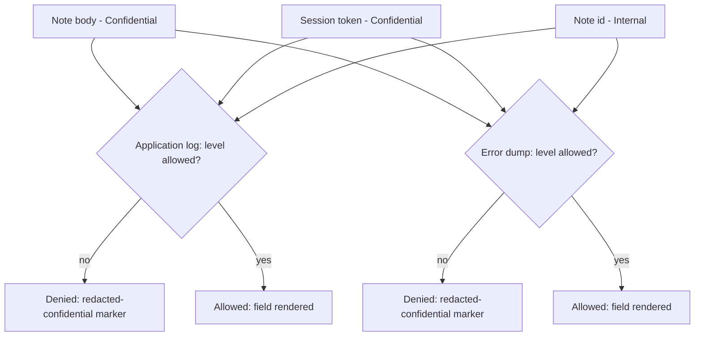

# A sink rule, not a label

**Kind:** concept-model
**Loop step:** 1 Property
**Standards:** OWASP ASVS 5.0.0 `v5.0.0-14.1.1` (final), `v5.0.0-14.1.2` (final), `v5.0.0-16.2.5` (final). Saltzer and Schroeder (1975) on fail-safe defaults.

## The claim you can prove false

SecureCollab's notes have a body field, and that body field is confidential. Writing "confidential" next to a field name in a document does nothing on its own, because nothing about a document changes what a running program will do with a string it is handed. The sentence worth testing is more specific than the label:

> For SecureCollab's `note_read` application log, a note body classified Confidential must not appear in the rendered line, because the log sink's own policy must refuse a Confidential field and must deny by default when a field's classification is unknown. If the classification exists only as a document with no code path that consults it, the answer is no: the body still reaches the log, because nothing at the sink itself changed.

Read that sentence clause by clause, because each clause is doing separate work and a reader who skips one will believe the rule holds when it does not. "Must not appear in the rendered line" names the observable failure: not "was the field marked," but "did the string actually show up in the output." "Because the log sink's own policy must refuse" locates the check at the one place that actually produces the leak — the function that builds the line — rather than at a document that the function never reads. "Must deny by default when a field's classification is unknown" is the clause every classification scheme leaves out, and it is the clause that decides what happens to the field nobody has thought about yet, which in a running system is most fields most of the time. "If the classification exists only as a document with no code path that consults it, the answer is no" states the failure mode this lesson's lab reproduces: a classification table that is accurate, reviewed, and present in the source file, sitting next to a function that never opens it.

A **sink**, in this lesson's vocabulary, is any place a field's value can end up once it leaves the object that was supposed to hold it: a log line, an exported report, a support ticket, a backup archive, an error page. A field does not have one classification and one fate; it has one classification and as many fates as there are sinks it can reach. "The note body is Confidential" is a claim about the field. "The note body must not appear in the application log" is a claim about a field-sink pair, and it is the second kind of claim, not the first, that a test can check.

## Two ways a label fails to become a control

A team can do everything a compliance checklist asks and still ship the exact failure this lesson names. Two failures are common enough to name individually, and naming them precisely is what separates a team that fixed the leak from a team that added a step nobody enforces.

The first failure is a classification that exists nowhere in the code at all: a spreadsheet, a Confluence page, a data-classification policy document, reviewed in a meeting and then never referenced by anything that runs. The second, subtler failure is a classification that does exist in the code — as a dictionary, a constant, an enum — but that no function actually reads before deciding what to log, export, or return in an error. `vulnerable/app.py` in this module's lab is written to exhibit the second failure specifically, because the first failure is easy to recognize and the second is not: a reviewer skimming the vulnerable fixture will find a `CLASSIFICATION` table that correctly marks the note body and the session token as `"confidential"`, sitting a few lines above a `log_event` function that builds its line from every field it is handed without once looking at that table. The classification is not missing. The classification is decorative.

`vulnerable/app.py`'s own table and function look like this, side by side:

```python
CLASSIFICATION: dict[str, str] = {
    "note_body": "confidential",
    "session_token": "confidential",
    "note_id": "internal",
}

def log_event(event: str, context: dict) -> None:
    rendered = " ".join(f"{key}={value}" for key, value in context.items())
    _LOG_LINES.append(f"{event}: {rendered}")
```

Read `log_event` on its own, with no memory of the table above it, and it is an ordinary structured-logging helper — the kind of function a working engineer writes without thinking twice, because nothing about it looks unusual in isolation. The defect is not visible inside this function; it is visible only in the *relationship* between this function and the table, which is that there is no relationship at all. `CLASSIFICATION` is never named inside `log_event`'s body. A reviewer who checks "does this module have a classification table" will answer yes. A reviewer who checks "does this function consult it" will answer no, and the second question is the one this lesson's property is actually about.

Both failures share one underlying mistake: treating classification as a fact about a field that, once recorded, protects the field wherever it travels. Classification is not a property that follows a value around a system the way an object's type does. It is an input to a decision that a specific piece of code has to make, every time that code runs, at every place the value could leave. A field's Confidential status is a fact your organization has recorded; whether that fact changes the log line is a fact about `log_event`, and only about `log_event`.

## Picture: two sinks, one decision each



Two things about this picture matter more than the boxes themselves. First, there are two decision points, not one — `LogCheck` and `ErrCheck` — because the application log and the error dump are two independent pieces of code, reached by two independent call paths, and a fix to one does not touch the other. Second, both decision points ask the same question of the same two fields, and both must answer "no" for the body and the token and "yes" for the note id, which is the actual content of the claim this lesson opens with: not "is this field marked," but "does this specific sink's policy admit this specific level."

## What must be trusted for this claim, and what changes it

For the claim above to hold, three things have to be true at once, and it is worth listing them separately because a design that gets two of the three right and the third wrong still fails the claim. The classification table (`CLASSIFICATION` in the lab fixture) has to correctly name the level of every field a sink might receive. The sink's policy (`SINK_POLICY`) has to correctly name which levels that specific sink is allowed to carry, based on a real, documented operational need — not "whatever the developer felt like allowing that day." And the function that builds the sink's output has to actually call the check before rendering anything, on every code path that reaches that sink, including the path an exception handler takes when a lookup fails.

Change the claim and this list changes, which is worth demonstrating rather than asserting. If the claim were instead "an operator can always tell why a request failed," the log line's *presence* of `note_id` and `event` would move onto the trusted list, and the classification table's correctness for those two fields would matter for a different reason — not "must these stay out," but "must these stay in." If the claim were "a session token cannot be replayed after logout," the classification table would be almost irrelevant; what would matter is the session-revocation mechanism itself, a mechanism this module does not build (see [4.1 Digital identity and account lifecycle](../../../4/4.1/lessons/01-property.md)). Classification is one property this system needs among several, and the trusted-component list for each property is its own list, not one shared inventory labeled "security."

## The attacker and operator capabilities this claim survives

Four kinds of reader can encounter a log line or an error dump without doing anything an attacker would call an exploit. An **operator** debugging a failed request has legitimate, routine access to application logs, and a redaction rule has to hold specifically against someone who is not attacking anything — they are doing their job, and the field still must not be there for them to see. A **log vendor** operating the search-and-index product a company pays for has contractual access to the same lines, at a company whose employees the note's author has never met. **Another company's administrator on a shared observability platform** — a common cost-saving setup where several tenants' logs land in one searchable index — can sometimes construct a query broad enough to catch a neighboring tenant's lines, which is a platform-configuration failure this lesson's classification rule cannot fix by itself but must not make worse by putting the body in the line in the first place. A **support agent** who pastes "what the log showed" into a ticket moves the same string into a fourth store this lesson's mechanism never touches directly, which is why [`lessons/06-operate.md`](06-operate.md) treats a support paste as its own named residual rather than an already-solved case.

What this claim deliberately does not defend against is different from what it defends against, and the difference is worth stating explicitly rather than leaving it implied. This claim says nothing about a person who has already compromised the server process itself and can read the classification table, the sink policy, and the fields directly from memory — that is a different property, owned by the mechanisms in [Phase 5's data lifecycle](../../../5/5.1/lessons/01-property.md) and by infrastructure isolation, not by a sink rule. It also says nothing about whether the *right* company can read its *own* note body through the normal application response; that is [4.4's authorization matrix](../../../4/4.4/spec.md), and this lesson's lab fixture deliberately does not gate reads by company, precisely so that its tests cannot be mistaken for testing that different property.

## Why the session token belongs on the same list as the note body

A reader who has followed classification discussions that only ever use "PII" or "sensitive content" as the example might reasonably conclude that this lesson's second sink is decoration — that the note body is the real asset and the session token is a supporting detail. Trace what each one actually grants a reader of the sink, and the ranking reverses. A party who reads a note body from a log line learns the content of one note. A party who reads a session token from the same log line can present that token to the application and act as its owner: read every note that owner could read, and, depending on how SecureCollab's write path is built, write or delete on that owner's behalf too. Reading content is one violation of confidentiality. Reading an authority artifact is a **different kind** of failure — an authorization bypass wearing a logging bug's clothes — and it is broader than the leak that triggered the classification discussion in the first place.

This is why [`lessons/02-model.md`](02-model.md) insists that an asset inventory limited to fields with content in them (a body, a title, an address) is not yet a complete inventory. An **authority artifact** — a value whose possession, not its content, grants access — has to be named and classified with the same rigor as a content field, and usually at a *higher* level, because the blast radius of its exposure is larger. A session token has no interesting content of its own; a random string is a random string. What it has is power, and power leaking through a debug line is not a smaller problem than content leaking through the same line — the lab you will run in [`lessons/03-break.md`](03-break.md) treats both as forbidden outcomes for exactly this reason, not as a primary bug and an afterthought.

## What comes next

[`lessons/02-model.md`](02-model.md) builds the inventory this lesson has only gestured at: which fields exist, which are authority artifacts rather than content, and which sinks each one can reach — including a second sink, reached only when a lookup fails, that a fix aimed at the first sink alone will never touch. [`lessons/03-break.md`](03-break.md) runs the vulnerable fixture and names the exact line where the classification table stops being consulted. [`lessons/04-build.md`](04-build.md) derives the fix — a check that runs at the sink, defaults an unnamed field to the most restrictive level, and still leaves an operator enough to debug with. [`lessons/05-verify.md`](05-verify.md) proves the fix holds against a fresh, never-hardcoded secret and against a sink that tries to fake redaction with a canned line. [`lessons/06-operate.md`](06-operate.md) and [`lessons/07-transfer.md`](07-transfer.md) carry the same rule to a detection signal and to a clinic record with two classes of field on one card.

## What this lesson is not doing

This lesson does not authorize running anything against a production log drain, a real clinic's records, or any system other than the local fixture under `labs/3.1/3.1-lab`. Run this only inside `labs/3.1/3.1-lab/`. The note body and session token used throughout are synthetic fixture values, not real credentials or real patient data, and the lab resets between runs.
