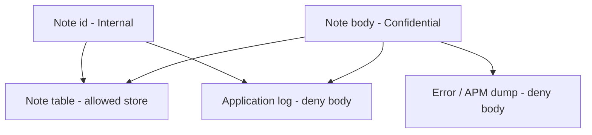
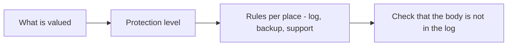

# Classification is a sink rule, not a spreadsheet sticker

**Kind:** concept-model
**Loop step:** 1 Property

## The rule

The notes app still stores note bodies. Those bodies are confidential. That word does nothing until it names **which places** may hold the field.

A log line for `note_read` is a lower-trust store than the note table. Operators can read it. A log vendor can read it. On shared observability, another company's admin might read it.

> For a `note_read` event, the log line must not contain the note body. It may contain allow-listed metadata: event name, note id, tenant id. Classification is a sink rule: a **field** plus **each place it can land**. A spreadsheet label, a privacy policy, or `DEBUG=true` does not enforce this.

A sink is a place the field can land: the note table, a log line, an error dump.

So what must not happen: **the confidential body in a lower-trust store**. `log_event("note_read", "tenant-A-secret-body")` must not include `tenant-A-secret-body`. That is a secrecy and privacy failure of the body.

Industry lists ask you to name sensitive data and to say how each level is logged. They do not redact this logger.

## Picture: field and place

Treat classification as a rule per field and per place, not as a sticker on a spreadsheet.



A sticker on the field that does not change the log API is just a sticker. What you trust is the **logging API handlers actually call**, plus every other printer: `print`, an f-string, an exception dump, a slow-query log, a packet capture.

The web framework does not know "Confidential." Access logs will store query strings — that is a later topic. A product name for data-loss tools is not this sentence.

## Picture: name the places before you redact



If the list of places does not include the log drain, redacting `logger.info` is incomplete. Operators still seeing **ids** is a different row. Write that down. Do not pretend ids are the body.

## People who can read a log line

| Person | What they can do here | Motive | Harm if the body is in the log |
|---|---|---|---|
| Operator | Read application logs | Debug a `note_read` | Reads company A's note body |
| Log vendor | Index and search the drain | Run the logging product | Same body, now in a third-party store |
| Another company's admin on shared observability | Read a shared log view | Operate their own tenant | Reads a body that is not theirs |
| Support | Paste "what the user saw" into a ticket | Close a ticket | The body leaves the log and lands in a ticket |

"Nation-state" can wait. This week needs the table above. Those four already get the body without a new bug name.

## Why it happens, what it costs, how you stop it, how you notice, how you recover

Someone treated the body as debug context. That is the cause. The person who later reads the log is a **result**, not the cause.

| Slice | For this rule |
|---|---|
| Why it happens | The body was treated as debug context |
| What has to be true first | The handler logs the event payload, including the body |
| Trigger | `log_event` for `note_read` |
| What it costs | The body sits in a lower-trust store; operators and vendors can read it |
| How you stop it | Structured logs with allow-listed fields; never paste the body into the line |
| How you notice | Tests and scans that the body substring is absent; a `log_redaction_miss` count |
| How you recover | Purge matching logs; rotate if tokens were present; do not log the body again while looking |

## What the framework does vs what you still have to check

Regex redaction after the fact misses encodings — a later topic. Error traces, slow-query logs, and full-packet dumps bypass the logger. FastAPI does not know Confidential.

What this practice is supposed to show: `log_event` line does not contain `tenant-A-secret-body` and does contain a redaction marker — files in `labs/3.1/3.1-lab`. Fake data only. No real people's data. No production log drain.

## What the tool cannot do

- A classification spreadsheet with no test.
- `DEBUG=True` in an environment that shares production data.
- Exception middleware that dumps the request body.
- Support tools that paste the body into a ticket. That leftover stays on the list.

## Practice

Name the field, the place it must not land, and the deny rule. Then run the local pair:

```text
python3 -m pytest labs/3.1/3.1-lab/tests --impl vulnerable
python3 -m pytest labs/3.1/3.1-lab/tests --impl fixed
```

Tie the check to the body in the log, not to a privacy-policy URL.

## Use it somewhere new

A clinic booking card. Chart text vs appointment time are two classes and two places. A card that logs the chart text fails this sentence even if the time is Internal.

## What this page is not doing

Do not use live log tenants, real patient charts, production log dumps, and “we classified it so it is protected.” Answer keys are not on this site.
