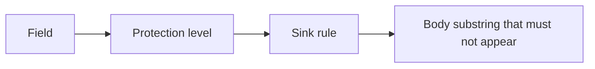

# An inventory someone else can test

**Kind:** design-exercise
**Loop step:** 2 Model

## Could someone else name the checks?

A list that says “PII, secrets, notes” is a pile of words. Name **fields**, **protection levels**, and **places** with allow or deny.

Note body, note id, tenant id, and a **local log line**. No live log product. No production backup vendor. Fake data only.

> For field *F* at place *S*, the rule is allow or deny. Evidence *E* would show the deny is false — here, the body substring in the log line.

If `note body` × `application log` is blank, logging appears because nobody named the place.

## Picture: three columns that must close

If any box is a product name or a policy URL, the row is not ready.

## Step 1: name the pieces

Take the fields you already have and ask where each one may land.

| Piece | This system |
|---|---|
| Who | App logger; operator; log vendor (a later topic) |
| What | Note body; note id; log line; classification tag |
| Actions | `log_event`; `read_logs` |
| Paths | stdout / log drain |
| What you trust for this journey | The logging API handlers actually call |
| What you do not trust | `print`, f-strings, APM dumps, exception `repr`, a spreadsheet, a privacy policy |
| Time | Logs can still be there after the note is deleted — a later topic |
| The rule | Secrecy and privacy of the body |

## Step 2: write allow and deny

| Who | What | Action | Decision |
|---|---|---|---|
| handler | body | log | deny |
| handler | note_id | log | allow |
| operator | logs | read | metadata only |
| log vendor | body | index | deny |

A missing body×log row is how the body shows up as debug context. Write the hole.

## Step 3: a backlog someone can review

For Confidential bodies: no log, no raw APM payload, no paste into a support ticket. For Internal ids: allowed in logs; **who may read those logs** is a different rule. Do not collapse the two.

Write the backlog in sentences a peer can attack:

1. **Log line.** The `note_read` line may hold event name, note id, tenant id. It may not hold the body.
2. **Error dump.** Exception text and slow-query logs are other places. They get the same deny for the body, even if this check only covers `log_event`.
3. **Support paste.** A ticket that quotes the body is a new place. Deny it here; do not wait for a later product to “handle patient data.”

## Step 4: leftover, not a deleted row

| Leftover | Why it remains | Do not pretend |
|---|---|---|
| Operators still see ids | Ids are Internal and allowed in this log | Ids are not the body |
| Logs after delete | Retention is a later topic | Redacting today's line does not erase history |
| Regex after the fact | Encodings can slip past — a later topic | A filter on `logger.info` is not every printer |

A maturity score and a scanner color do not belong in this list.

## Practice

Mark `classify.py` under `labs/3.1/3.1-lab`. Note field, level, place, and the row that would prove the deny false. No real people's data.

## Use it somewhere new

Chart text and appointment time are two classes, in two places. Logging the time does not authorize logging the chart.

## What can still go wrong

Operators still see ids. How long logs live after a note is deleted stays on the list. Regex redaction is not encoding-safe.

## What this page is not doing

Do not run this list against a public clinic or a live log tenant. Answer keys are not on this site.
