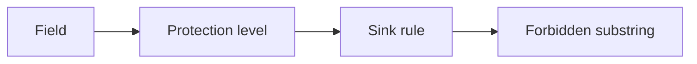

# 3.1-LO-02 — An inventory a second engineer can test

**Kind:** design-exercise
**Loop step:** 2 Model
**Standards:** NIST CSF 2.0 (final) Identify; OWASP ASVS 5.0.0 (final) `v5.0.0-14.1.1` and `v5.0.0-14.1.2`.

## Can a second engineer name pytest cases from your inventory?

A list of “PII, secrets, notes” is not this lesson. An inventory names **fields**, **protection levels**, and **sinks** with allow or deny.

SecureCollab Phase 1 freeze: note body, note id, tenant id, local log line. No real ELK, no production backup vendor.

## Mental model: three columns that must close

If `note body` × `application log` is blank, ambient logging appears.

## Step 1: freeze fields and subjects

| Piece | This system |
|---|---|
| Subjects | App logger; operator; SIEM vendor (later 10.5) |
| Objects | Note body; note id; log line; classification tag |
| Actions | `log_event`; `read_logs` |
| Channels | stdout / log drain |
| TCB | Logging API used by handlers |
| Untrusted | `print`, f-strings, APM, exception `repr` |
| State / time | Logs retained after the note is deleted (5.1 hole) |
| 1.1 cell | Confidentiality and privacy of the body |

## Step 2: write cells

| Subject | Object | Action | Decision |
|---|---|---|---|
| handler | body | log | deny |
| handler | note_id | log | allow |
| operator | logs | read | metadata only |
| SIEM vendor | body | index | deny |

## Step 3: requirements backlog (reviewable)

For Confidential bodies: no log, no APM raw payload, no support paste. For Internal ids: allowed in logs; still 1.2 who may read logs.

## Practice

Draw the inventory so a second engineer could name pytest cases. Point at `labs/3.1/3.1-lab` file `classify.py`.

## Transfer

Clinic notes vs appointment time: two classes, two sinks.

## Residual risk

Operators still see ids. Retention after deletion is 5.1. Regex redaction is not encoding-safe (2.1).

## Non-goals

Top 10 as the definition of security. Keys stay out of lessons.
