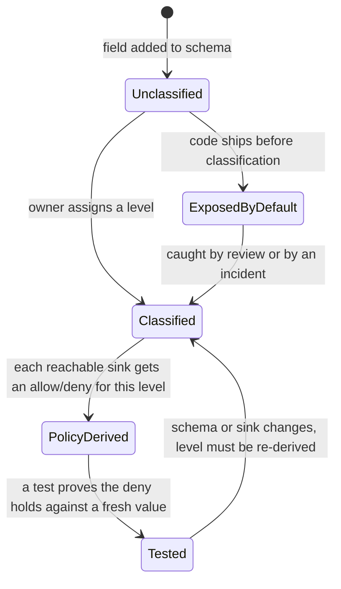

# Two sinks, one asset class: an inventory a second engineer can test

**Kind:** design-exercise
**Loop step:** 2 Model

## What an inventory has to name before it is useful

A data inventory that lists "note body: Confidential" and stops has recorded a fact, but it has not yet produced anything a second engineer could implement or test, because it has not said which sinks that fact constrains. The inventory this lesson builds adds the missing dimension: for every asset, name every place it can land, and for every asset-sink pair, name the decision. A pair with no recorded decision is not neutral — [`lessons/01-property.md`](01-property.md) already showed that an unrecorded decision resolves, by the default behavior of ordinary code, to "expose it" — so a blank cell in this inventory is a defect to close, not a row to leave for later.

Carry forward what earlier modules already established for SecureCollab. [1.2's access-matrix tuple](../../../1/1.2/lessons/01-property.md) named subjects, actions, objects, and state for *who may do what*; this lesson names assets, sinks, and levels for *what may go where*, and the two models are deliberately parallel, because both are instances of the same underlying discipline: a security property is a relation between specific things, never a property of one thing labeled in isolation. [2.2's request-path model](../../../2/2.2/lessons/01-property.md) already established that SecureCollab's origin resolves a caller's company from a session-bound credential, never from a client-supplied header — this lesson's session token is the same credential 2.2 protects on the way in; here, the question is what happens to that same value on the way *out*, through a log or an error report, once it has already done its job of identifying the caller.

## Naming the pieces without collapsing them

| Word | Precise question | SecureCollab, this phase |
|---|---|---|
| Asset | What is a value that has to be protected somewhere, independent of any single sink? | Note body; session token; note id; company id; account email (named, not yet built) |
| Authority artifact | Does possessing this value alone let a party act as someone else, without any further check? | Session token: yes. API key: yes. Note id, company id: no — they identify an object, they do not grant power |
| Sink | Where can an asset's value legitimately or accidentally come to rest once it leaves the object meant to hold it? | Application log; error/diagnostic dump; a future export; a support ticket; a backup archive |
| Classification level | The category that determines which sinks may carry this asset at all | Confidential; Internal (this module uses two; a real system may need more, and adding a level is a decision this table must record, not a decision a developer makes silently by choosing a word) |
| Sink policy | Which levels this specific sink is documented and permitted to carry, and why | Application log and error dump: Internal only, because neither has a documented operational need for Confidential content |
| Classification owner | Who decided this level, and what would make them revisit it | Named per field in the backlog; a field with no named owner is a field nobody has actually decided about, however confidently a comment claims otherwise |

Keep these six words from collapsing into each other, because two are easy to confuse in exactly the way that produces an incomplete inventory. **Asset** and **authority artifact** are not the same category: every authority artifact is an asset, but not every asset is an authority artifact, and the distinction is not decoration — it is why a session token needs a *higher* bar than a note body even though both are marked Confidential, and why [`lessons/01-property.md`](01-property.md) spent a full section justifying that ranking rather than asserting it. **Sink** and **classification level** are not the same either: a level is a property of the asset; a sink is a property of the destination; the policy that connects them is a third thing, and it is the third thing — not either of the first two alone — that a test can actually check by looking at rendered output.

## First worked discrimination: a new function that is not a new boundary

Suppose a teammate proposes wrapping `log_event` in a new function that takes the same context dictionary, does some cosmetic formatting, and calls `log_event` underneath:

```python
def log_note_read_event(context: dict) -> None:
    """A new, better-named entry point for note-read logging."""
    tidy = {k: v for k, v in context.items() if v is not None}
    log_event("note_read", tidy)
```

On a diagram, this looks like progress: there is a new function, a new name, a layer that suggests someone thought about logging as its own concern. Ask the only question that matters for this lesson's property: does anything about the new function change which levels can reach the rendered line? `tidy` drops fields whose value is `None` — a real transformation, doing real work — but it does not consult `CLASSIFICATION` or `SINK_POLICY` at all, so a populated `note_body` or `session_token` passes through this filter exactly as it would without it. If `log_note_read_event` does not itself check `CLASSIFICATION` against `SINK_POLICY` before calling through, the answer is no — the note body and the session token pass through exactly as before, wearing a new function name on the way. A box on a diagram is evidence of effort, not evidence of a control. This is the same lesson [1.3's transparent-relay example](../../../1/1.3/lessons/01-property.md) teaches for network hops, applied here to a code-level wrapper: a hop, or a call, that changes no assumption is not a boundary, however real the extra line of code is.

## Second worked discrimination: a boundary that does not look like one

Now take the opposite case. A company's engineering team decides to route application logs through a third-party observability vendor's search product, on the reasoning that "it's still our logs, just easier to search." Nothing about the code that calls `log_event` changes. No new function appears on a diagram. And yet a real boundary has been crossed: the log line, once written, now sits on infrastructure a different organization operates, under that organization's access controls, retention policy, and staff — exactly the "log vendor" reader [`lessons/01-property.md`](01-property.md) named as a party this module's classification rule has to survive. If the observability platform is *shared* across several of that vendor's customers on one search index, a second boundary appears alongside the first: another company's administrator, querying their own tenant's logs, might construct a search broad enough to catch a neighboring customer's lines — the "shared observability" reader from the same list. Neither boundary shows up as a new box in the application's own architecture diagram, because both are facts about where a value ends up, not about how the code that produced it is organized. An inventory that only tracks code-level components will miss both; an inventory built around sinks — where does the value actually land — catches them, because "a third-party's search index" and "another tenant's dashboard" are sinks in exactly this lesson's sense, however far they sit from the application's own repository.

## Picture: what a field's classification actually goes through



The failure transition is the one most classification discussions never draw: `Unclassified --> ExposedByDefault`. A field does not wait, unprotected but harmless, for someone to get around to classifying it. The moment code that logs, exports, or serializes a dictionary ships with that field present, the field is already in `ExposedByDefault`, because — as [`lessons/01-property.md`](01-property.md) derived — every ordinary sink treats an unnamed field as ordinary data, not as a pending decision. The loop back from `Tested` to `Classified` matters too: a level, once correctly derived and tested, is not permanent. A new sink added later, or a field repurposed for a new use, re-opens the question, which is why this lesson's inventory needs a named owner and a review trigger, not just a level.

## What can change between the decision and the use

A check that ran correctly once does not stay correct forever, and two kinds of drift matter here specifically. The first is a **classification drift**: a field once reasonably called Internal — say, a note's creation timestamp — can become sensitive in combination with other fields a later feature adds, such as a precise location captured alongside the timestamp. The code that classified the timestamp Internal was correct when it was written; it is wrong the moment the location field ships, and nothing in the timestamp's own classification entry changes automatically just because a different field's context shifted around it. The second is a **retention drift**: a log line correctly redacted at write time can still be copied into a backup, an analytics export, or a long-lived archive whose retention policy outlives the classification decision that produced the line. [5.1's data lifecycle](../../../5/5.1/lessons/01-property.md) owns the second drift; this lesson's job is only to name it as a residual rather than let a reader believe a redacted line, once written, is safe forever regardless of where copies of it end up.

## Practice

Using the fields in the table above, fill in a fourth column — sink policy — for a support ticket sink: for each field, allow or deny, and one sentence naming what would have to be documented before the answer could be "allow." Then trace the state diagram's failure transition for a field this module's lab does not classify at all — the `X-Debug-Hint` header value used in `labs/3.1/3.1-lab`'s tests — and predict, before running anything, which state it starts in and which sinks a correct fix must still deny it from.

## Use it somewhere new

A clinic's booking card carries chart text and an appointment time on one record. Before [`lessons/07-transfer.md`](07-transfer.md) asks you to write the backlog for it, predict from this lesson's table alone which of the two fields is more likely to double as, or to sit beside, an authority artifact in a clinic system — a patient portal session token, for instance — and why an inventory that only lists "chart text: sensitive" would miss that artifact exactly the way this lesson's opening section warned against.

## What this lesson is not doing

This lesson models SecureCollab's Phase 2 assets as they exist in the local lab fixture; it does not claim a production logging pipeline, a real third-party vendor contract, or a deployed shared-observability platform. Do not run this inventory exercise against a real vendor's dashboard, a real clinic's system, or any log drain outside `labs/3.1/3.1-lab`.
