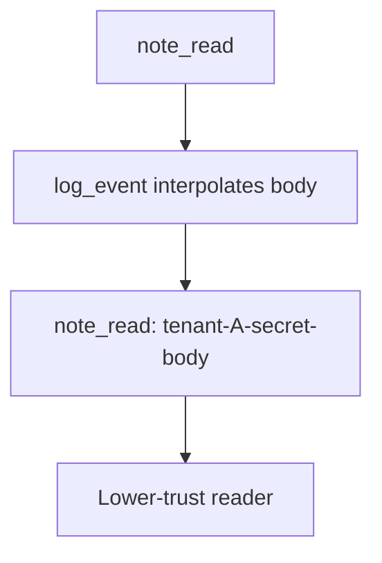

# 3.1-LO-03 — Observe the body in the log line, do not trophy it

**Kind:** mechanism-lab
**Loop step:** 3 Break
**Standards:** OWASP ASVS 5.0.0 (final) `v5.0.0-16.2.5`.

## Authorized scope

`labs/3.1/3.1-lab` only. Synthetic string `tenant-A-secret-body`. No production log drains, no real PII.

**Forbidden outcome:** Confidential note body appears in a log line.

## Mental model: debug context is the leak



The vulnerable tree demonstrates **cause** (body treated as debug context), not a trophy dump of a real tenant.

## What to read in the fixture

`vulnerable/classify.py` `log_event` returns `f"{event}: {note_body}"`. The test asserts the body substring is absent and a redaction marker is present.

## Root cause vs impact

| Slice | Lab |
|---|---|
| Root cause | Body treated as debug context |
| Impact | Confidential field in a lower-trust store |
| Not the lesson | A privacy-policy URL or DLP product name |

## Practice

```
python3 -m pytest labs/3.1/3.1-lab/tests --impl vulnerable
```

Record the failing test `test_note_body_is_not_logged`. Do not weaken it to “logs exist.”

## Transfer

Clinic chart text in an appointment log. Predict without leaving this directory.

## Non-goals

No live-target instructions. Synthetic data only.
