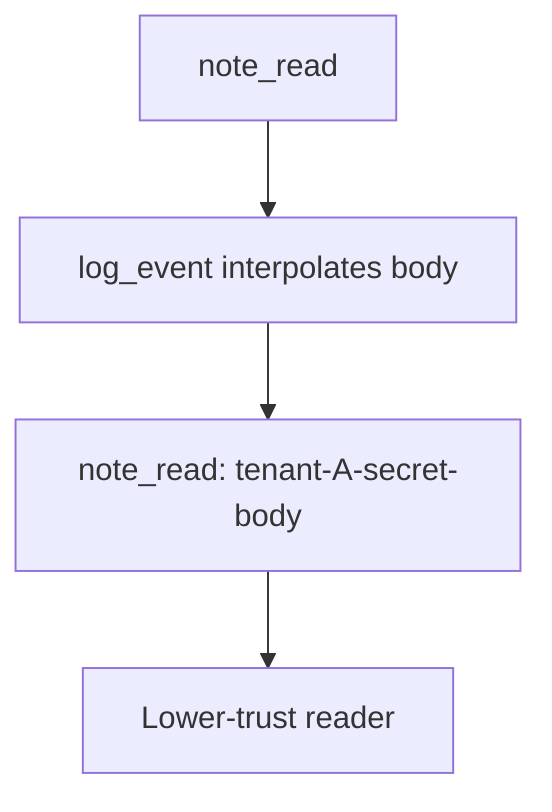

# 3.1-LO-03 — Observe the body in the log line, do not trophy it

**Kind:** mechanism-lab
**Loop step:** 3 Break
**Standards:** OWASP ASVS 5.0.0 (final) `v5.0.0-16.2.5` and `v5.0.0-14.1.2`; NIST CSF 2.0 (final) Identify as an outcome family, not a redaction control.

## Authorized scope

`labs/3.1/3.1-lab` only. The fixture is an in-process `log_event` string. Synthetic string `tenant-A-secret-body`. No production log drains, no real PII, no live SIEM tenant, no patient chart. Do not paste a real note body into the logger “to see what happens.”

**Forbidden outcome:** Confidential note body appears in a log line. `log_event("note_read", "tenant-A-secret-body")` includes `tenant-A-secret-body`.

Attacker capability in this lab: an operator, SIEM vendor, or another tenant’s admin on shared observability who can read the log line. That stands in for uvicorn access logs, exception `repr`, APM, and a support ticket. Trust assumption: the logging API is supposed to deny the body sink. A Confluence classification sticker, a privacy policy URL, `DEBUG=false` in one environment, and a DLP product name are not in the TCB for this cell.

## Mental model: debug context is the leak



The vulnerable tree demonstrates **cause** (body treated as debug context), not a trophy dump of a real tenant. Preconditions: a `note_read` event; a handler that interpolates the body into the line. You do not need a production drain. The substring in the returned line *is* the leak.

ASVS `v5.0.0-16.2.5` wants logging to enforce the protection level (credentials never; other data hashed or masked). `v5.0.0-14.1.2` wants each protection level to say **how the data is logged**. CSF Identify names inventory; it does not redact uvicorn.

## What to read in the fixture

`vulnerable/classify.py` `log_event` returns `f"{event}: {note_body}"`. The test asserts the body substring is absent **and** a redaction marker (`redacted` or `confidential`) is present.

You do not need a new body string. The failure of `test_note_body_is_not_logged` *is* the evidence.

Do not open the fixed tree yet. Diagnose the cause first.

## Root cause vs impact vs prevention vs detection vs recovery

| Slice | This lab |
|---|---|
| Required property | Confidential field does not appear in this log sink |
| Root cause | Body treated as debug context; the sink accepts the field |
| Preconditions | Handler logs the event payload including the body |
| Trigger | `log_event("note_read", "tenant-A-secret-body")` |
| Impact | Confidentiality and privacy of the body in a lower-trust store (1.1 cell) |
| Prevention | Structured logs with allow-listed fields; never interpolate the body |
| Detection | Tests that the body substring is absent; `log_redaction_miss` |
| Recovery | Purge matching logs; rotate if tokens were present; do not log the body again while investigating |
| Not the lesson | A privacy-policy URL, a DLP product name, or “logs are internal” |

## Framework defaults versus the field guarantee

FastAPI does not know Confidential. uvicorn access logs will store query strings (4.3). Regex redaction after the fact misses encodings (2.1). The application guarantee is: **this** fixture’s line does not contain `tenant-A-secret-body`.

## Practice

```text
python3 -m pytest labs/3.1/3.1-lab/tests --impl vulnerable
```

Record the failing test `test_note_body_is_not_logged`. Do not weaken it to “logs exist.” An environment error is not security evidence.

## Transfer

Clinic chart text in an appointment log. Predict, without leaving this directory, whether logging the booking time is a different class from logging the chart. Do not fetch a clinic.

## Non-goals

No live-target instructions. Synthetic data only. No production log dumps.
