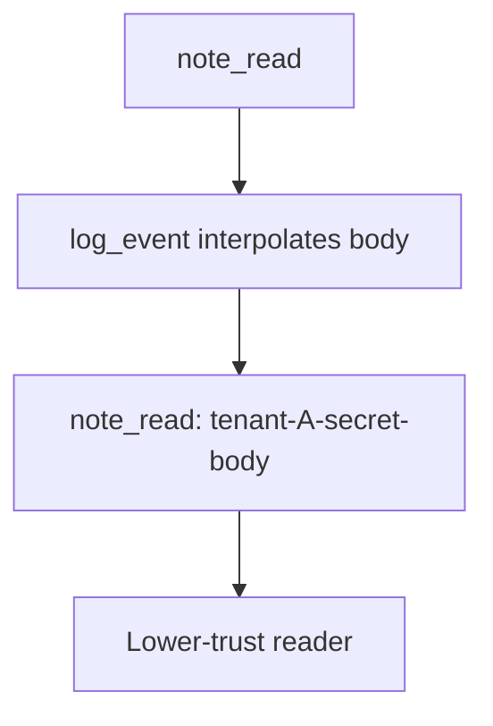

# Practice: a confidential note appears in a log line

**Kind:** mechanism-lab
**Loop step:** 3 Break

## Try it

The practice is not a website you attack. `log_event` returns a string: it pastes the note body into the line, so the log already holds the secret.

> A confidential note body must not appear in this log line. If `log_event("note_read", "tenant-A-secret-body")` includes `tenant-A-secret-body`, logging has failed as a security control.

## Where you may practice

Stay inside `labs/3.1/3.1-lab`. The body is the synthetic string `tenant-A-secret-body`. No production log drains, no real people's data, no live log tenant, no patient chart.

Do not paste a real note body into the logger “to see what happens.” Do not paste this exercise onto a public log drain, employer dashboard, or live clinic.

The logging API is supposed to deny the body — not A spreadsheet sticker, a privacy-policy URL, `DEBUG=false` in one environment, or a data-loss product name.

Picture an operator, a log vendor, or another company's admin on shared observability — access logs, exception dumps, APM, and a support ticket.

## Picture: debug context is the leak



You do not need a production drain. The chart substring is already in the returned line.

## What to look at: the cause, not a hunt

In `vulnerable/classify.py`, `log_event` returns `f"{event}: {note_body}"`. The test asserts the body substring is absent **and** a redaction marker (`redacted` or `confidential`) is present.


| What you see | What kind of failure | Not the lesson |
|---|---|---|
| Body interpolated into the line | Confidential field in a lower-trust store | “Logs are internal” |
| Event name plus the secret | Debug context used as the payload | A privacy-policy URL |
| No redaction marker | The sink accepted the field | “Make DEBUG false” |

## Why it happens vs what it costs

| Slice | Practice |
|---|---|
| Why it happens | The body was treated as debug context; the log accepted the field |
| What's already wrong | A `note_read` event; a handler that pastes the body into the line |
| Trigger | `log_event("note_read", "tenant-A-secret-body")` |
| What it costs | Secrecy and privacy of the body in a lower-trust store |
| How you stop it later | Structured logs with allow-listed fields; never paste the body |
| How you notice later | Tests that the body substring is absent; `log_redaction_miss` |
| How you recover later | Purge matching logs; rotate if tokens were present; do not log the body again while looking |
| Out of scope | A privacy-policy URL, a data-loss product name, or “logs are internal” |

FastAPI does not know Confidential. Access logs will store query strings — a later topic. Regex after the fact misses encodings — a later topic. Line does not contain `tenant-A-secret-body`.

## Practice

```text
python3 -m pytest labs/3.1/3.1-lab/tests --impl vulnerable
```

Record the failing test `test_note_body_is_not_logged`. “Logs exist” is not that test. A setup error is not proof the rule holds.

## Use it somewhere new

Chart text in an appointment log is a different class from the booking time. Predict, without leaving this directory, whether logging the booking time is a different class from logging the chart. Do not fetch a clinic.

## What this page is not doing

No live-target steps. Fake data only. No production log dumps. Do not “fix” the practice by deleting the test.
