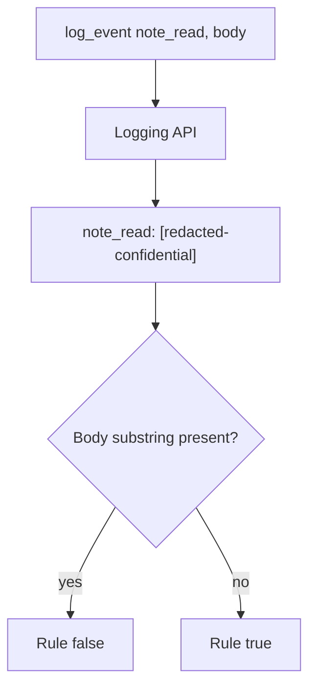

# Allow-list log fields; never paste the body

**Kind:** design-exercise
**Loop step:** 4 Build

## The rule

A denylist of yesterday's log format is not the fix. Hiding a scanner warning is not the fix. “We classified it Confidential” is not the fix.

The structural change is: `log_event` **does not include the body string**. The logging API does not accept the body as a format argument. Not a regex after the fact. Not a spreadsheet label. Not `DEBUG=false` in one environment. Not a data-loss product name.

The smallest restore for a notes-app `note_read` is: return a redaction marker and never paste `note_body` into the line. Production should use structured fields (`event`, `note_id`, `tenant_id`) and never have a `body=` key. If you are unsure whether a value is Confidential, do not log it.

## Picture: redact at the API



The repaired files return `[redacted-confidential]`. Ids in logs remain a different row — write that down; do not pretend ids are the body. Exception middleware, slow-query logs, and APM still bypass this logger. Name them as leftover, not as silent passes.

Naming the field is empty until each place has a deny or allow. This check is the log line only.

## What the repaired files must show

Read `fixed/classify.py` against this checklist. Do not treat the snippet as a production logger.

| After the fix | Must be true |
|---|---|
| Line | does not contain `tenant-A-secret-body` |
| Line | contains `redacted` or `confidential` (the local marker) |
| Event name | still present so operators can debug *that a read happened* |

Fail closed: if you are unsure, omit the value. Uncertainty is a **no** on “this may go in the line,” not a yes because the dashboard looked useful.

## What this is not

- Regex redaction of encodings (a later topic).
- Exception middleware dumps.
- Access logs that store query strings (a later topic).
- A classification spreadsheet.
- A privacy-policy URL.
- Backup stores (later topics).
- Support tools that paste the body into a ticket. That leftover stays.

## What the tool cannot do

- A sticker on the field that does not change the log API is just a sticker.
- `DEBUG=True` in an environment that shares production data puts the body through other printers.
- Full-packet APM and slow-query logs bypass `logger.info`.
- Hashing the body into the line can still leak if the body is guessable. This practice uses a marker, not a hash of the secret.

## Can people still use it

Classification itself is not an accessibility problem. If operators see a redaction marker in a dashboard, do not encode “Confidential” as color only. Keyboard users and people who cannot rely on color still need a name or text, not a red square.

## Practice

Name field (note body), place (application log line), and the check that must be true after the fix (substring absent). Run:

```text
python3 -m pytest labs/3.1/3.1-lab/tests --impl fixed
```

It must pass. Then write one sentence: which rule is restored, and which leftover you refused to delete.

## Use it somewhere new

A clinic example: log appointment time; never log chart text. Two classes, two places. A booking card that logs the chart fails this sentence even if the time is Internal.

## What can still go wrong

Ids in logs. How long logs live after a note is deleted. APM still capturing payloads. Exception `repr`. Query strings in access logs.
