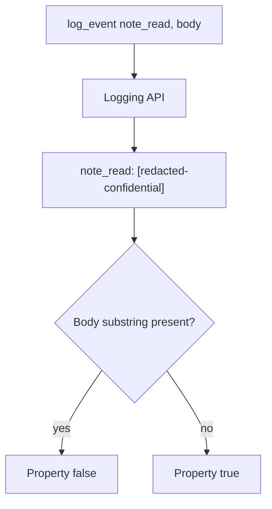

# 3.1-LO-04 — Allow-list the log fields; never interpolate the body

**Kind:** design-exercise
**Loop step:** 4 Build
**Standards:** OWASP ASVS 5.0.0 (final) `v5.0.0-16.2.5` and `v5.0.0-14.1.2`.

## Structural means the sink cannot see the field

`log_event` must not include the body string. Structural means the logging API does not accept the body as a format argument—not a regex after the fact, not a Confluence label, not `DEBUG=false` in one environment.

## Mental model: redact at the API



The lab’s fixed tree returns a redaction marker. Production should use structured fields (`event`, `note_id`) and never have a `body=` key. Fail-safe: if you are unsure whether a value is Confidential, do not log it.

## Why this restores the cell

| After the fix | Must be true |
|---|---|
| Line | does not contain `tenant-A-secret-body` |
| Line | contains `redacted` or `confidential` (lab marker) |

## What this is not

Regex redaction of encodings (2.1). Exception middleware dumps. uvicorn query strings (4.3). Classification spreadsheet.

## Practice

Name field, sink, and predicate. Run:

```
python3 -m pytest labs/3.1/3.1-lab/tests --impl fixed
```

Must pass.

## Transfer

Clinic: log appointment time; never log chart text. Two classes, two sinks.

## Residual risk

Ids in logs; retention after deletion (5.1); APM still capturing payloads.
