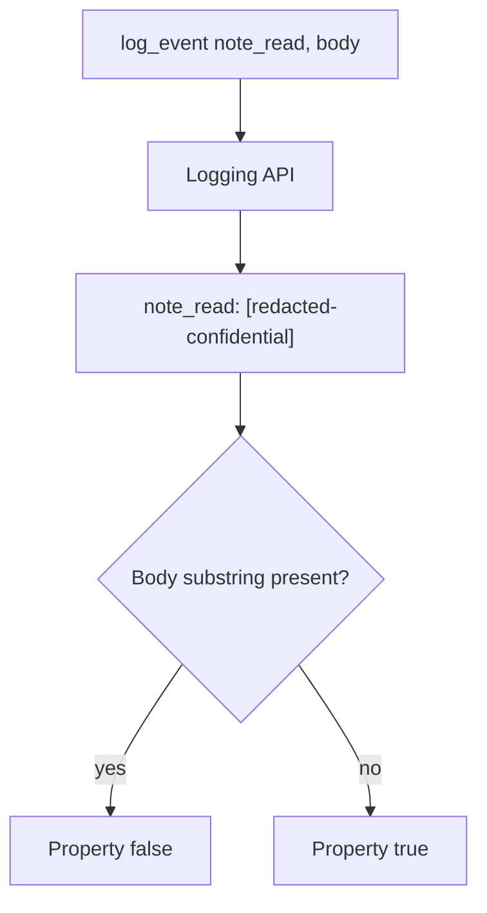

# 3.1-LO-04 — Allow-list the log fields; never interpolate the body

**Kind:** design-exercise
**Loop step:** 4 Build
**Standards:** OWASP ASVS 5.0.0 (final) `v5.0.0-16.2.5` and `v5.0.0-14.1.2`. Privacy Framework 1.1 remains a **draft** if cited; this cell uses 1.0 outcomes only as labels.

## Structural means the sink cannot see the field

`log_event` must not include the body string. Structural means the logging API does not accept the body as a format argument—not a regex after the fact, not a Confluence label, not `DEBUG=false` in one environment, not a DLP product name.

The smallest restore for SecureCollab Phase 1 `note_read` is: return a redaction marker and never interpolate `note_body`. Production should use structured fields (`event`, `note_id`, `tenant_id`) and never have a `body=` key. Fail-safe: if you are unsure whether a value is Confidential, do not log it.

## Mental model: redact at the API



The lab’s fixed tree returns `[redacted-confidential]`. Ids in logs remain a different cell—document it; do not pretend ids are the body. Exception middleware, slow-query logs, and APM still bypass this logger—name them as residuals, not silent passes.

ASVS `v5.0.0-14.1.1` wants sensitive data identified and classified. That inventory is empty until each sink has a deny or allow. This pytest is the log sink only.

## Why this restores the cell

| After the fix | Must be true |
|---|---|
| Line | does not contain `tenant-A-secret-body` |
| Line | contains `redacted` or `confidential` (lab marker) |
| Event name | still present so operators can debug *that a read happened* |

## What this is not

Regex redaction of encodings (2.1). Exception middleware dumps. uvicorn query strings (4.3). Classification spreadsheet. Privacy policy URL. Backup stores (5.1 / 10.5). Support tools that paste the body into a ticket (1.4 / 4.2 residual).

## Mechanism limits

- A sticker on the field that does not change the log API is theater.
- `DEBUG=True` in an environment that shares production data reintroduces the body through other printers.
- Full-packet APM and slow-query logs bypass `logger.info`.
- Hashing the body into the line can still be a leak if the body is guessable; this lab uses a marker, not a hash of the secret.

## Practice

Name field (note body), sink (application log line), and predicate (substring absent). Run:

```text
python3 -m pytest labs/3.1/3.1-lab/tests --impl fixed
```

Must pass.

## Transfer

Clinic: log appointment time; never log chart text. Two classes, two sinks. An EHR-lite booking card that logs the chart fails this sentence even if the time is Internal.

## Residual risk

Ids in logs; retention after deletion (5.1); APM still capturing payloads; exception `repr`; uvicorn query strings (4.3).

## Usability

Classification itself is not a WCAG problem. If operators see a redaction marker in a dashboard, do not encode “Confidential” as color-only (WCAG 2.2 Success Criterion 1.4.1).
