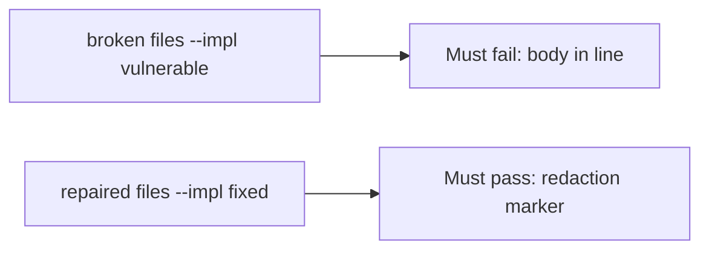

# A broken log line must fail the check

**Kind:** verification-lab
**Loop step:** 5 Verify

## If you cannot test it, it is still a slogan

“We have a classification spreadsheet” is not evidence. “Logs are internal” is a trust assumption, not an observation. The check is: `log_event("note_read", "tenant-A-secret-body")` does not contain `tenant-A-secret-body` and does contain a redaction marker. That observation must be **false** on the broken files and **true** on the repaired files.

## Picture: a broken log line must fail the check

A test that only asserts logs exist can pass while the body is still in the line. Ask whether a confidential field in this log still counts as a pass. The broken files must fail that. The repaired files must pass it.



If both pass, the test is not looking at the body substring. If both fail, the fix is not structural or the check is wrong.

## Four modes, even for a log line

| Mode | Must show for this topic |
|---|---|
| Normal | After the fix, the line still names the event (`note_read`) |
| Wrong input | Body substring absent; redaction marker present; broken files must fail |
| Abuse | Unsure values are not logged (fail closed; leftover if not in this check) |
| Not claimed | All places covered; production logs clean; exception middleware safe; access logs safe |

The file is `labs/3.1/3.1-lab/tests/test_property.py`. The test `test_note_body_is_not_logged` calls `log_event` with the synthetic body and asserts the substring is absent. That is a **what must not happen** test: a confidential field in this log is not allowed to count as a pass.

A test that only asserts HTTP 200 is not this topic's evidence. A test that only greps `Confidential` in a spreadsheet without calling `log_event` is not this topic's evidence. This practice never opens a production drain.

```text
python3 -m pytest labs/3.1/3.1-lab/tests --impl vulnerable
python3 -m pytest labs/3.1/3.1-lab/tests --impl fixed
```

Map the test to the body×log row you wrote. If the broken files do not fail, the lab is miswired — fix the wiring, not the assertion. A setup error is not proof the rule holds.

## What the tests do not prove

- Exception middleware
- Access logs (a later topic)
- Backup stores (later topics)
- APM / full-packet capture
- Support tickets
- That ids in logs are acceptable (write that row separately)
- A draft privacy-framework checklist

Record those as leftover or later topics, not as silent passes.

## Practice

Run both this session:

```text
python3 -m pytest labs/3.1/3.1-lab/tests --impl vulnerable
python3 -m pytest labs/3.1/3.1-lab/tests --impl fixed
```

Paste nothing from answer keys. Write fail/pass into your notes next to the body×log row.

## Use it somewhere new

Clinic chart vs time. A test that only asserts HTTP 200 is not classification evidence. A test that reads a live clinic log drain is out of scope.

## What this page is not doing

Do not add a production drain. Do not paste `tenant-A-secret-body` into tickets. Answer keys are not on this site.
