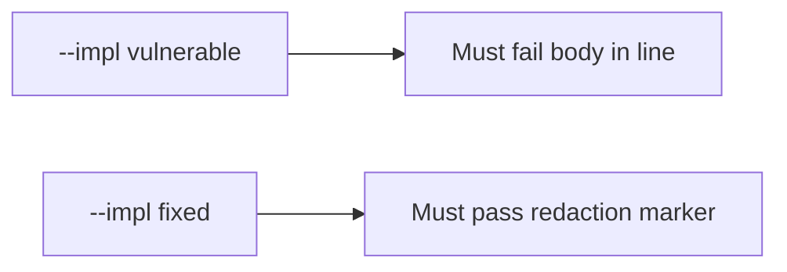

# 3.1-LO-05 — Evidence is a failing body substring, then a passing pair

**Kind:** verification-lab
**Loop step:** 5 Verify
**Standards:** OWASP ASVS 5.0.0 (final) `v5.0.0-16.2.5`. A classification spreadsheet is not this pair.

## An invariant that cannot fail a test is still a slogan

“We have a classification spreadsheet” is not evidence. “Logs are internal” is a trust assumption, not an observation. The oracle is: `log_event("note_read", "tenant-A-secret-body")` does not contain `tenant-A-secret-body` and does contain a redaction marker. That observation must be **false** on `--impl vulnerable` and **true** on `--impl fixed`.

## Mental model: vulnerable must fail: body in line

The failing observation on `--impl vulnerable` is **body in line**. A passing collection count is not this cell.



| Mode | Must show for this module |
|---|---|
| Normal | After the fix, the line still names the event (`note_read`) |
| Negative / abuse | Body substring absent; redaction marker present; vulnerable must fail |
| Failure | Unsure values are not logged (fail closed; residual if not in this pytest) |
| Not claimed | All sinks covered; production SIEM clean; exception middleware safe; 4.3 access logs safe |

Lab test: `test_note_body_is_not_logged` in `labs/3.1/3.1-lab/tests/test_property.py`. It calls `log_event` with the synthetic body and asserts the substring is absent. That is a **forbidden-outcome** test: a Confidential field in this sink is not allowed to count as a passing control.

```text
python3 -m pytest labs/3.1/3.1-lab/tests --impl vulnerable
python3 -m pytest labs/3.1/3.1-lab/tests --impl fixed
```

Map the test to the LO-02 body×log cell. If vulnerable does not fail, the lab is miswired—fix the wiring, not the assertion. An environment error is not security evidence.

## What the tests do not prove

- Exception middleware
- Access logs (4.3)
- Backup stores (5.1 / 10.5)
- APM / full-packet capture
- Support tickets (1.4 / 4.2)
- That ids in logs are acceptable (document that cell separately)
- Privacy Framework 1.1 (draft) compliance

Record those as residuals or later modules, not as silent passes.

## Practice

Execute both implementations this session. Write the fail/pass pair next to the matrix row. Reject a “test” that only greps `Confidential` in a spreadsheet without calling `log_event`.

## Transfer

Clinic chart vs time. A test that only asserts HTTP 200 is not classification evidence. A test that reads a live clinic log drain is out of scope.

## Non-goals

Do not add a production drain. Do not paste `tenant-A-secret-body` into tickets. Keys stay out of this file.
