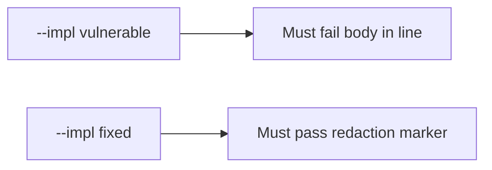

# 3.1-LO-05 — Evidence is a failing body substring, then a passing pair

**Kind:** verification-lab
**Loop step:** 5 Verify
**Standards:** OWASP ASVS 5.0.0 (final) `v5.0.0-16.2.5`.

## An invariant that cannot fail a test is still a slogan

“We have a classification spreadsheet” is not evidence. The oracle is the local pair.

## Mental model: vulnerable must fail: body in line

The failing observation on `--impl vulnerable` is **body in line**. A passing collection count is not this cell.



| Case | Must show |
|---|---|
| Negative / abuse | Body substring absent |
| Marker | `redacted` or `confidential` present in the fixed line |
| Not claimed | All sinks; production SIEM |

Lab test: `test_note_body_is_not_logged` in `labs/3.1/3.1-lab/tests/test_property.py`.

```
python3 -m pytest labs/3.1/3.1-lab/tests --impl vulnerable
python3 -m pytest labs/3.1/3.1-lab/tests --impl fixed
```

## What the tests do not prove

- Exception middleware
- Access logs (4.3)
- Backup stores (5.1 / 10.5)

## Practice

Execute both implementations. Map the test to the LO-02 body×log cell.

## Transfer

Clinic chart vs time. A test that only asserts HTTP 200 is not classification evidence.
