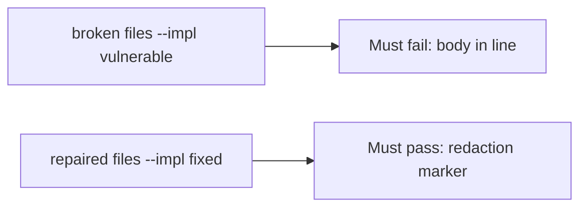

# A broken log line must fail the check

**Kind:** verification-lab
**Loop step:** 5 Verify

## Check it

A classification spreadsheet does not keep the note body out of the log. “Logs are internal” is a trust assumption, not an observation. After `log_event("note_read", "tenant-A-secret-body")`, the line must not contain `tenant-A-secret-body` and must contain a redaction marker. Vulnerable files: the body is still in the line. Repair redacts `tenant-A-secret-body`.

## Picture: a broken log line must fail the check

Asserting logs exist can still hide that the body is still in the line.



If the broken log line also passes, you never searched for the body substring.

## What the check has to show

| Mode | Must show for this topic |
|---|---|
| Normal | After the fix, the line still names the event (`note_read`) |
| Wrong input | Body substring absent; redaction marker present; broken files must fail |
| Abuse | Unsure values are not logged (fail closed; leftover if not in this check) |
| Not claimed | All places covered; production logs clean; exception middleware safe; access logs safe |

The test `test_note_body_is_not_logged` calls `log_event` with the synthetic body and asserts the substring is absent. That check is there so a confidential field in this log still fails.

A Confidential label in a spreadsheet is not `log_event`. This practice never opens a production drain.

```text
python3 -m pytest labs/3.1/3.1-lab/tests --impl vulnerable
python3 -m pytest labs/3.1/3.1-lab/tests --impl fixed
```

Map the test to the body×log row you wrote. If the broken files do not fail, the lab is miswired — fix the wiring, not the assertion. A setup error is not proof the rule holds.

## What the tests do not prove

- Exception middleware
- Access logs (a later topic)
- Backup stores (later topics)
- APM / full-packet capture
- Support tickets
- That ids in logs are acceptable (write that row separately)
- A draft privacy-framework checklist

## Use it somewhere new

HTTP 200 on an appointment log is not classification evidence. Do not run a test that reads a live clinic log drain.

## What this page is not doing

Do not add a production drain. Do not paste `tenant-A-secret-body` into tickets. Answer keys are not on this site.
