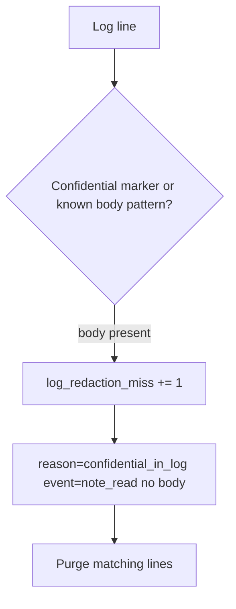

# 3.1-LO-06 — Detect a redaction miss; purge without logging the body again

**Kind:** operations-exercise
**Loop step:** 6 Operate
**Standards:** NIST CSF 2.0 (final) DE/RS/RC as outcome labels; OWASP ASVS 5.0.0 (final) `v5.0.0-16.2.5`.

## Prevention is not absolute

A new handler, an exception printer, or an APM agent can reintroduce the body. Pair detect and recover. Do not log the body while investigating.

## Mental model: alert on substring, then purge



| Outcome | This module |
|---|---|
| Detect | `log_redaction_miss`; tests in CI |
| Signal | event name, request id; never the body |
| Recover | Purge; rotate if tokens present |
| Residual | Operators still see ids; document that cell |

## Practice

Write one log line you would accept. Tie it to `labs/3.1/3.1-lab`.

```
log_denied reason=confidential_field event=note_read request_id=req_81aa
```

Reject any line that includes `tenant-A-secret-body`.

## Transfer

Clinic: detect chart text in appointment logs; purge without pasting the chart into the ticket.

## Non-goals

SIEM product names are not the property.
