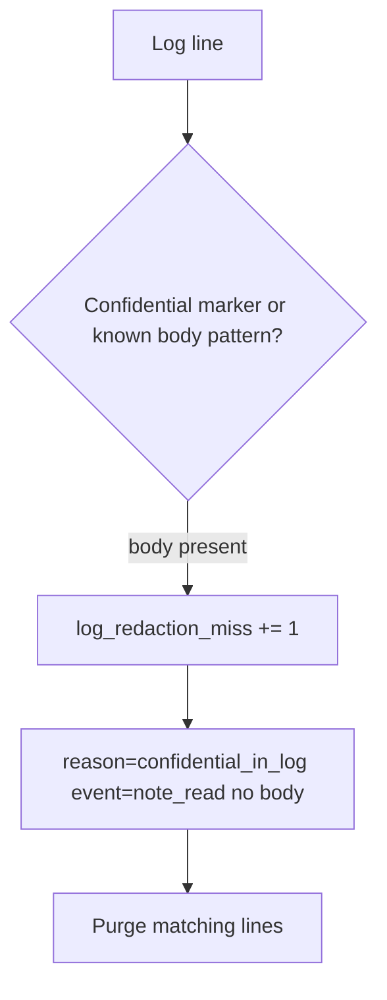

# Notice a redaction miss; purge without logging the body again

**Kind:** operations-exercise
**Loop step:** 6 Operate

## Stopping it is not enough

Even after `log_event` was fixed once, a new handler, an exception printer, or an APM agent can put the body back. Running it for real is the rest of the loop: notice, contain, purge, and refuse to “help” by logging the body again.

Do not paste the matching line into Slack, a ticket, or a lesson note.

## Picture: alert on the substring, then purge

A redaction miss is a notice-and-recover problem, not a licence to quote the secret in the paging channel. Notice names the event. Recover purges the line. Neither reprints the body.



Industry lists name detect, respond, recover. They do not pick a log product. They do not prove this line is clean. Someone still has to own the leftover.

## Signals that do not become a second leak

| Outcome | This topic |
|---|---|
| Notice | `log_redaction_miss`; a CI test that the synthetic substring is absent |
| What the line holds | Event name, request id — **never** the body |
| Respond | Stop the printer that reintroduced the field; do not paste the matching line into chat |
| Recover | Purge matching lines; rotate if tokens were present; re-run `test_note_body_is_not_logged` |
| Leftover | Operators still see ids; write that row down; APM and access logs remain other places |

A log line a reviewer can accept looks like:

```text
log_denied reason=confidential_field event=note_read request_id=req_81aa
```

Not: `tenant-A-secret-body`, a note body, a patient chart, or a card number.

If your alert includes the matching line, you have copied the leak into the paging channel.

## What the framework does vs what you still have to check

The same access logs, exception dumps, and APM drains that bypass the logger will also bypass a “scan our app logs” detector. Name those places before you claim recover. A log-product name is not the rule.

## Can people still use it

If operators see a redaction-miss badge, do not encode it as color only. Give it a name or text a screen reader can speak.

## Practice

Write one log line you would accept in review (ids, reason, no body). Tie it to `labs/3.1/3.1-lab`. Reject any line that includes `tenant-A-secret-body`, a note body, a patient chart, or a card number.

## Use it somewhere new

Clinic: notice chart text in appointment logs; purge without pasting the chart into the ticket. Support tools: notice a paste of the body into a ticket the same way.

## What this page is not doing

A log-product name is not the rule. Do not run live queries against production logs. Answer keys stay out of lessons.
