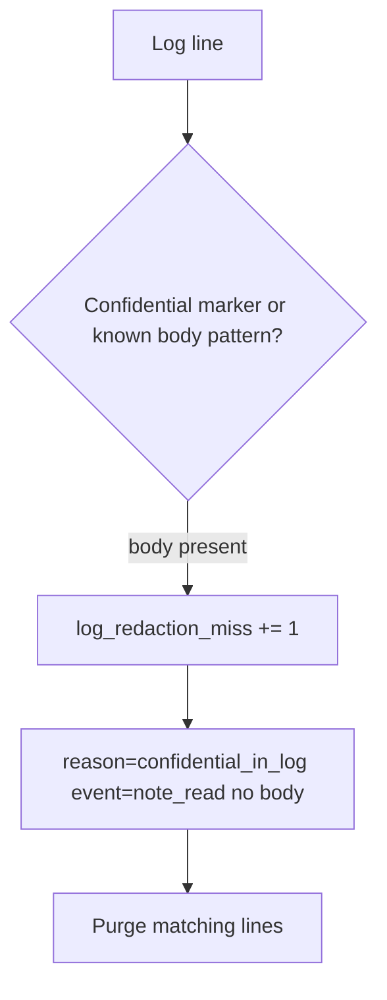

# 3.1-LO-06 — Detect a redaction miss; purge without logging the body again

**Kind:** operations-exercise
**Loop step:** 6 Operate
**Standards:** NIST CSF 2.0 (final) DE/RS/RC as outcome labels; OWASP ASVS 5.0.0 (final) `v5.0.0-16.2.5`. CSF names outcomes; it does not redact the line.

## Prevention is not absolute

A new handler, an exception printer, or an APM agent can reintroduce the body after `log_event` was “fixed once.” Pair detect and recover. Do not log the body while investigating. Do not paste the matching line into Slack, a ticket, or a lesson note.

## Mental model: alert on substring, then purge



| Outcome | This module |
|---|---|
| Detect | `log_redaction_miss`; CI test that the synthetic substring is absent |
| Signal | event name, request id; never the body |
| Recover | Purge matching lines; rotate if tokens present; re-run `test_note_body_is_not_logged` |
| Residual | Operators still see ids; document that cell; APM and access logs remain other sinks |

CSF 2.0 names Detect / Respond / Recover. They do not prove `v5.0.0-16.2.5`. A SIEM product name is not the property.

## Framework defaults versus the operate guarantee

The same uvicorn / exception / APM drains that bypass the logger will also bypass a “scan our app logs” detector. Inventory those sinks (LO-02) before claiming Recover. If your alert includes the matching line, you have duplicated the leak into the paging channel.

## Practice

Write one log line you would accept. Tie it to `labs/3.1/3.1-lab`.

```text
log_denied reason=confidential_field event=note_read request_id=req_81aa
```

Reject any line that includes `tenant-A-secret-body`, a note body, a patient chart, or a PAN.

## Transfer

Clinic: detect chart text in appointment logs; purge without pasting the chart into the ticket. Support tools (1.4): detect paste of the body into a ticket the same way.

## Usability

If operators see a redaction-miss badge, do not encode it as color-only (WCAG 2.2 Success Criterion 1.4.1).

## Non-goals

SIEM product names are not the property. Do not instruct live SIEM queries against production. Gates 0–10 stay not-attempted without learner or product evidence.
