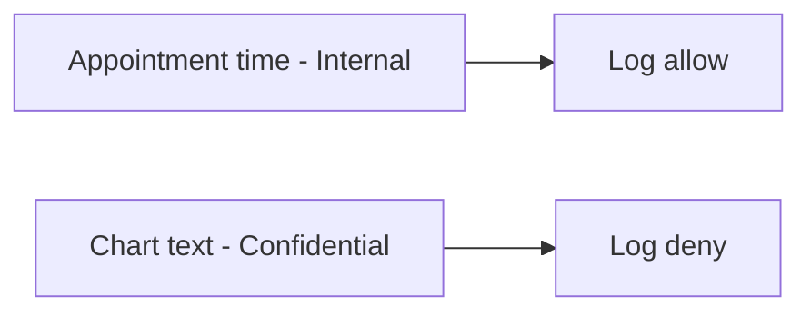

# 3.1-LO-07 — Transfer: two classes on a clinic booking card

**Kind:** transfer-challenge
**Loop step:** 7 Transfer
**Standards:** OWASP ASVS 5.0.0 (final) `v5.0.0-14.1.1` and `v5.0.0-16.2.5`. Privacy Framework 1.1 remains a **draft** if cited.

## Change the fields; keep field × sink

Do not answer with a Top 10 / CWE / scanner as the definition of security. The SecureCollab sentence was: `log_event("note_read", "tenant-A-secret-body")` must not contain the body. Rewrite it for a booking card without changing the fork.

**Prompt:** Clinic notes vs appointment time: two classes, two sinks.

**Product sketch:** EHR-lite booking card.

Rewrite the SecureCollab sentence. Include:

1. attacker capabilities (operator with logs; vendor with the drain; another tenant on shared observability — **not** a live clinic);
2. trust assumptions (which logging API is TCB; the spreadsheet and the privacy policy are not);
3. forbidden outcome (chart text in the log, not “HIPAA” and not “we classified it”);
4. a test idea on a **local** fixture only (substring absent + marker present);
5. residual (time is Internal and may be logged; ids remain; APM; exception middleware; 4.3 query strings);
6. WCAG 2.2 only if a human-mediated control is in the claim (classification itself is not a WCAG problem; color-only “Confidential” badges are).

## Mental model: time is not the chart

Two classes on one card is the point. Logging the time does not authorize logging the chart. A single “PHI” sticker that does not name sinks is theater. `v5.0.0-14.1.1` wants identification; `v5.0.0-16.2.5` wants the log to enforce the level.

## What graders reject

| Reject | Why |
|---|---|
| Spreadsheet as the property | No sink rule |
| Live clinic logs | Lab policy |
| Privacy policy URL | Mechanism theater |
| “HIPAA” as the oracle | Awareness / legal label, not this pytest |
| HTTP 200 as classification evidence | Wrong observation |

## Practice

One page. No keys. `labs/3.1/3.1-lab` is the only running system you may break. Do not fetch a clinic, dump a production drain, or use real patient identifiers.

## Non-goals

Live SIEM tenants. Real charts. Claiming Gate 3 from this page. Mixing Privacy Framework 1.1 (draft) as if it were final.
