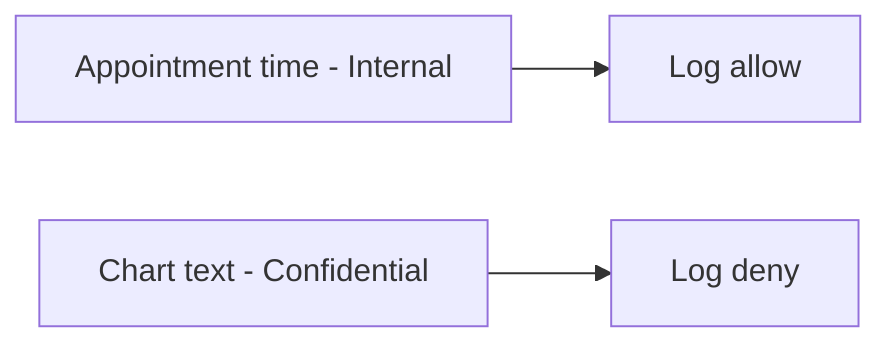

# 3.1-LO-07 — Transfer: two classes on a clinic booking card

**Kind:** transfer-challenge
**Loop step:** 7 Transfer
**Standards:** OWASP ASVS 5.0.0 (final) `v5.0.0-14.1.1` and `v5.0.0-16.2.5`.

## Change the fields; keep field × sink

Do not answer with a Top 10 / CWE / scanner as the definition of security.

**Prompt:** Clinic notes vs appointment time: two classes, two sinks.

**Product sketch:** EHR-lite booking card.

Rewrite the SecureCollab sentence. Include:

1. attacker capabilities (operator with logs; vendor with the drain; not a live clinic);
2. trust assumptions (which logging API is TCB);
3. forbidden outcome (chart text in the log, not “HIPAA”);
4. a test idea on a local fixture only;
5. residual (time is Internal; ids remain; APM);
6. WCAG 2.2 only if a human-mediated control is in the claim (classification itself is not a WCAG problem).

## Mental model: time is not the chart

## What graders reject

| Reject | Why |
|---|---|
| Spreadsheet as the property | No sink rule |
| Live clinic logs | Lab policy |
| Privacy policy URL | Mechanism theater |

## Practice

One page. No keys. `labs/3.1/3.1-lab` is the only running system you may break.
