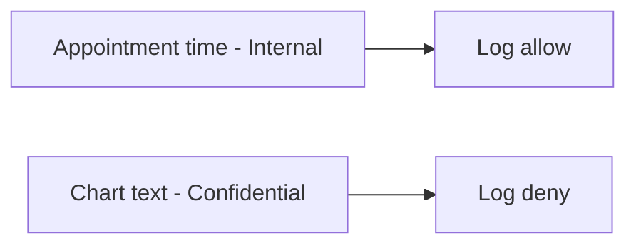

# Same idea on a clinic booking card

**Kind:** transfer-challenge
**Loop step:** 7 Transfer

## Use it somewhere new

You get a **clinic booking card**. Chart text and appointment time sit on the same card.

`log_event("note_read", "tenant-A-secret-body")` must not contain the body. For a booking card, field × place, allow or deny.

## Picture: time is not the chart

Here, the chart text is still this topic’s note body. Name the field, every place it is printed, and what still changes after the log line is “clean.” Logging the time does not authorize logging the chart. A single “sensitive” sticker that does not name places is just a sticker.

| Notes app | Clinic sketch |
|---|---|
| Note body is Confidential | Chart text is Confidential |
| Note id / tenant id may be Internal | Appointment time may be Internal |
| `note_read` log line | Appointment log line |
| Operator / vendor / shared observability | Same readers — **not** a live clinic |
| Body substring in the line | Chart substring in the line |

Two classes on one card is the point.

## Write this for a clinic booking card

1. who might try (operator with logs; vendor with the drain; another company on shared observability — **not** a live clinic);
2. what you trust (which logging API; the spreadsheet and the privacy policy are not);
3. what must not happen (chart text in the log, not “we classified it”);
4. a check on **local** files only (substring absent + marker present — never on the real clinic);
5. leftover (time is Internal and may be logged; ids remain; APM; exception dumps; query strings in access logs);
6. whether a human-read badge must not use color as the only cue (classification itself is not an accessibility problem; color-only “Confidential” badges are).

## What is not good enough

| Reject | Why |
|---|---|
| Spreadsheet as the rule | No place named; no allow or deny |
| Live clinic logs | Course rules |
| Privacy-policy URL | A document is not the logger |
| A famous-bugs name as the check | Awareness, not this check |
| HTTP 200 as classification evidence | Wrong observation |

## Practice

Write one page. Leave the answer keys closed. The only running system you may break is `labs/3.1/3.1-lab`. Do not fetch a clinic, dump a production drain, or use real patient identifiers.

## What this page is not doing

Do not use live log tenants. Do not use real charts. Do not mix a draft privacy list as if it were final.
