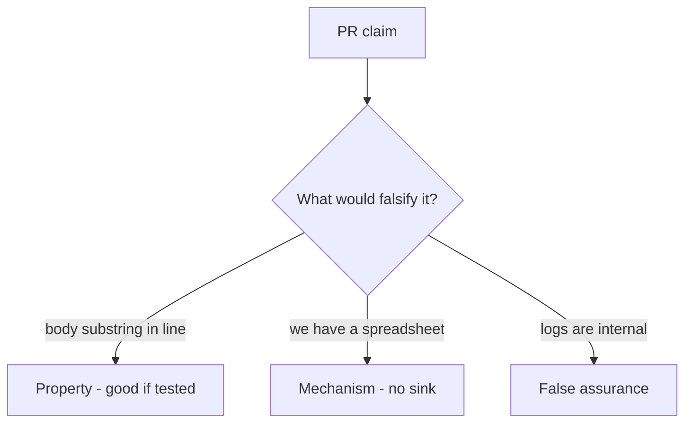

# 3.1-LO-08 — Review the body-in-log as a PR, not a slogan

**Kind:** code-review
**Loop step:** Review
**Standards:** OWASP ASVS 5.0.0 (final) `v5.0.0-16.2.5`.

## Review the fixture as if it were SecureCollab logging

Review `labs/3.1/3.1-lab/vulnerable/` as a SecureCollab PR. Intended findings live only in `content/assessment/keys/3.1.md` — not here.

## Mental model: logger.info('read %s', note.body)

Start with this seeded smell: **`logger.info('read %s', note.body)`**. Label it property, mechanism, or false assurance before you accept the PR.

Seeded smells (label them yourself; do not open the keys file):

- `logger.info('read %s', note.body)`
- Classification spreadsheet with no test
- `DEBUG=True` in a “staging” that shares prod data
- Exception middleware dumps request body

Also reject: client trust, DLP product as the property, closing findings without retest, keys in lessons, real PII in fixtures.

## Misconceptions

- If we classified it, it is protected
- Logs are internal so safe
- Privacy policy equals redaction

## Practice

Write three review notes. Tie at least one to `test_note_body_is_not_logged`.

## Transfer

Clinic booking card. A PR that “adds a Confidential label” without a log test is incomplete.
