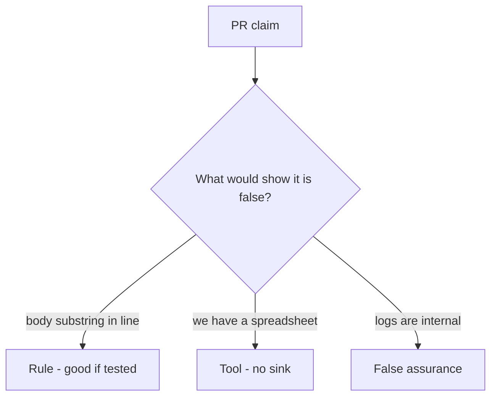

# Review of a note body in the log

**Kind:** code-review
**Loop step:** Review

## What you are reviewing

Open `log_event` and the body×log row. For each claim, mark **rule**, **tool**, or **false assurance**, and say whether the body still lands in the log if they ship. A spreadsheet can wait.

“Will redact later” is a promise. `test_note_body_is_not_logged` is the evidence.

## Picture: problems to find (name them yourself)

**`logger.info('read %s', note.body)`**.

The body substring still has to be absent from this log. If the change never uses an allow-listed log API, the leftover is still there.

## Problems to find (name them yourself)

- `logger.info('read %s', note.body)`
- Classification spreadsheet with no test
- `DEBUG=True` in a “staging” that shares production data
- Exception middleware dumps the request body

Also reject: treating a Confidential badge as the log omit; a data-loss product as the rule; closing findings without re-running `test_note_body_is_not_logged`; keys in learner notes; real people's data in the practice files; a privacy-policy URL as the fix.

## Common mix-ups

- If we classified it, it is protected
- Logs are internal so they are safe
- A privacy policy equals redaction
- Regex after the fact is the sink rule
- FastAPI or the server's access-log defaults know Confidential
- HTTP 200 proves classification

## Use it somewhere new

On a clinic booking card, a Confidential label without a log test does not say where the field can land. A Confidential label is not a log test — write the chart-text omit.

## Can people still use it

If the dashboard shows a Confidential or redaction-miss badge, do not encode it as color only. That is a cue for operators, not a privacy policy.

## What this page is not doing

You cannot waive a logged body with “will redact later.” Assign an owner or keep the finding open. Do not dump production logs to prove the finding.
