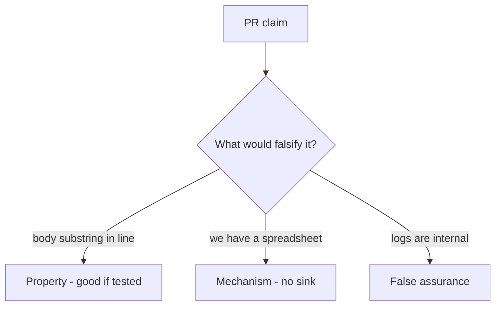

# 3.1-LO-08 — Review the body-in-log as a PR, not a slogan

**Kind:** code-review
**Loop step:** Review
**Standards:** OWASP ASVS 5.0.0 (final) `v5.0.0-16.2.5` and `v5.0.0-14.1.2`.

## Review the fixture as if it were SecureCollab logging

Review `labs/3.1/3.1-lab/vulnerable/` as a SecureCollab PR. Your job is not to count suspicious lines. Reconstruct whether `log_event` still interpolates the body, compare that with the module invariant, and write changes a developer can verify.

Intended findings live only in `content/assessment/keys/3.1.md` — not here. Do not open the keys file until your review has been evaluated.

## Mental model: logger.info('read %s', note.body)

Start with this seeded smell: **`logger.info('read %s', note.body)`**. Label it property, mechanism, or false assurance before you accept the PR.

Classification starts at the protected effect (body substring absent from this sink). Everything that is not an allow-listed log API at that call is a candidate ambient path.

## Seeded smells (label them yourself)

- `logger.info('read %s', note.body)`
- Classification spreadsheet with no test
- `DEBUG=True` in a “staging” that shares prod data
- Exception middleware dumps request body

Also reject: client trust as the TCB; DLP product as the property; closing findings without re-running `test_note_body_is_not_logged`; keys in learner notes; real PII in fixtures; privacy-policy URL as the fix.

## Misconceptions this module refuses

- If we classified it, it is protected
- Logs are internal so safe
- Privacy policy equals redaction
- Regex after the fact is the sink rule
- FastAPI or uvicorn defaults know Confidential
- HTTP 200 proves classification

## Practice

Write three review notes a maintainer could act on. Each note: observation, property or false assurance, suggested structural change, residual you will **not** delete. Tie at least one to `test_note_body_is_not_logged`.

## Transfer

Clinic booking card. A PR that “adds a Confidential label” without a log test is an incomplete mediation review. Name the independent falsehood that would still keep chart text out of the appointment log.

## Non-goals

Do not merge by adding a comment “will redact later.” That comment is a residual without an owner. Do not dump production logs to prove the finding.
