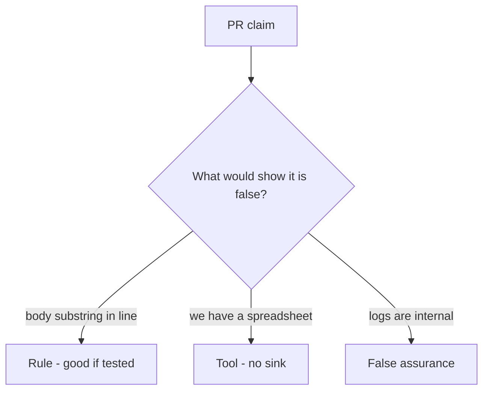

# Review of a note body in the log

**Kind:** code-review
**Loop step:** Review

## What you are reviewing

This review is about notes-app logging. Your job is to label each claim **rule**, **tool**, or **false assurance**, and to say whether the body still lands in the log if they ship. Start at `log_event` and the body×log row, not at a scanner color or a spreadsheet.

You already ran `test_note_body_is_not_logged`. A comment “will redact later” is not.

## Picture: problems to find (name them yourself)

**`logger.info('read %s', note.body)`**.

The body substring still has to be absent from this log. If the change never uses an allow-listed log API, the leftover is still there.

## Problems to find (name them yourself)

- `logger.info('read %s', note.body)`
- Classification spreadsheet with no test
- `DEBUG=True` in a “staging” that shares production data
- Exception middleware dumps the request body

Also reject: trusting the browser as the vault; a data-loss product as the rule; closing findings without re-running `test_note_body_is_not_logged`; keys in learner notes; real people's data in the practice files; a privacy-policy URL as the fix.

## Common mix-ups

- If we classified it, it is protected
- Logs are internal so they are safe
- A privacy policy equals redaction
- Regex after the fact is the sink rule
- FastAPI or the server's access-log defaults know Confidential
- HTTP 200 proves classification

## Use it somewhere new

Clinic booking card. A change that “adds a Confidential label” without a log test is an incomplete review of where the field can land. Name the independent falsehood that would still keep chart text out of the appointment log.

## Can people still use it

If the dashboard shows a Confidential or redaction-miss badge, do not encode it as color only. That is a cue for operators, not a privacy policy.

## What this page is not doing

Do not merge by adding a comment “will redact later.” That comment is leftover without an owner. Do not dump production logs to prove the finding.
