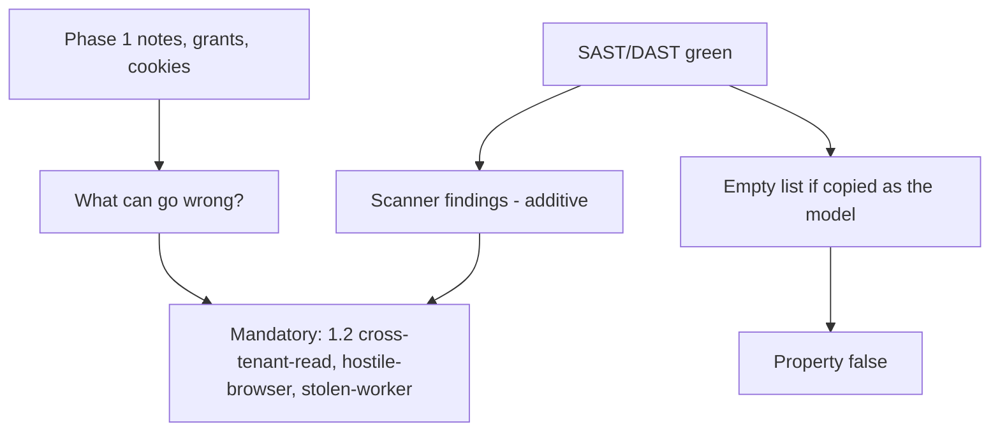
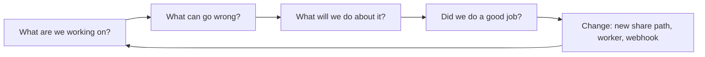

# 3.2-LO-01 — A green scanner is not an empty threat model

**Kind:** concept-model
**Loop step:** 1 Property
**Standards:** OWASP Threat Modeling Project (maintained guidance, live-checked 2026-09-06) Four Question Framework; NIST SP 800-154 IPD remains **draft** (March 2016; NIST still plans to finalize as of 2025-01-23); OWASP ASVS 5.0.0 (final) `v5.0.0-15.1.3` (Level 2 documented security decisions) and `v5.0.0-15.1.5` (**Level 3, advanced** — dangerous-functionality documentation). ASVS 5.0 removed a numbered “do threat modeling” requirement; Appendix D is process **awareness**, not a verification ID.

## The claim this module owns

SecureCollab Phase 1 still has a cross-tenant reader (1.2), a hostile Next.js client (2.3), and a future worker identity that will execute with stored grants (7.4). None of those are CVEs a scanner must find today. A green SAST/DAST/SCA run is coverage for *implementation* bugs that happen to match a rule. It is not a model of what can go wrong for the assets.

> For SecureCollab Phase 1, a version-controlled threat model must still list `cross-tenant-read`, `hostile-browser`, and `stolen-worker` when every scanner is green. Scanner findings are extra coverage, not the set. STRIDE letters without assets, owners, and invalidation conditions are not this sentence.

The forbidden outcome is **empty model on green scan**: `threats_from_scan(scanner_green=True)` returns `[]`, so `cross-tenant-read` is missing. That is a 1.1 *integrity of the assurance story* failure: untested 1.2 and 1.3 cells look “done.”

ASVS `v5.0.0-15.1.3` wants documented security decisions you can verify in the running system — not a ceremony named STRIDE. `v5.0.0-15.1.5` is **Level 3 (advanced)** and wants dangerous functionality called out in documentation; it is not a silent baseline. Appendix D still recommends threat modeling on design change; that recommendation is not a numbered requirement you can pass by pasting a tool report.

## Mental model: scanner is coverage, not the model



The TCB for this property is the **versioned list with owners and triggers**, plus the CI gate that those ids exist. The scanner process is untrusted as an oracle. FastAPI, Semgrep, and a vendor dashboard do not know 1.2.

**Mechanism (not the property):** Threat Dragon, a DFD PNG, or “we did STRIDE in the sprint.” A named product is not this sentence.

## Mental model: four questions, not a sticker pack



OWASP’s Threat Modeling Project is methodology-neutral. STRIDE, PASTA, LINDDUN, and attack trees are *prompts* under question two. LINDDUN is valuable for 5.1 privacy flows; it will not list IDOR for you. SP 800-154 (draft) is data-centric: pick the data, then model attack and defense — still not a substitute for owners and invalidation.

## Root cause vs impact vs prevention vs detection vs recovery

| Slice | For this property |
|---|---|
| Root cause | Tool output substituted for thinking |
| Preconditions | `scanner_green=True`; assembler copies that as “no threats” |
| Trigger | CI or a reviewer asks “what’s in the model?” |
| Impact | Integrity of the assurance story: 1.2/1.3 cells untested |
| Prevention | Seed mandatory threats; union scanner findings |
| Detection | CI fails if required ids, owners, or triggers are missing |
| Recovery | Add the threat, tests, and owner; do not back-date the file |

## Framework defaults versus the model guarantee

A “no High findings” ticket is not a threat model. Framework secure-defaults (HttpOnly, parameterized queries) are 2.3/6.1 mechanisms; they do not enumerate cross-tenant read. The application guarantee in this lab: **this** fixture still returns `cross-tenant-read` when the scanner is green. Oracle: `labs/3.2/3.2-lab`. No live targets, no production scanner tenant.

## Mechanism limits

- STRIDE stickers on a DFD without invalidation conditions.
- Moving threats to “accepted” with no residual owner.
- Treating Appendix D or Top 10 as ASVS compliance.
- A model that is not in git, so nobody can see it age.

## Practice

Name three threats that remain if every CVE is patched. Then run:

```
python3 -m pytest labs/3.2/3.2-lab/tests --impl vulnerable
python3 -m pytest labs/3.2/3.2-lab/tests --impl fixed
```

The first command must fail. The second must pass. Map the assertion to `cross-tenant-read` still present, not to a scanner product name.

## Transfer

Clinic SMS reminders: the new channel is not in the Phase 1 HTTP model. Which threats appear that no CVE scanner will list?

## Non-goals

Live-target scanning, real PII in fixtures, weaponized copy-paste exploits, and “green scan means ship.” Gates 0–10 and milestones M0–M5 stay **not-attempted** without learner or product evidence. Answer keys are not in this file.
