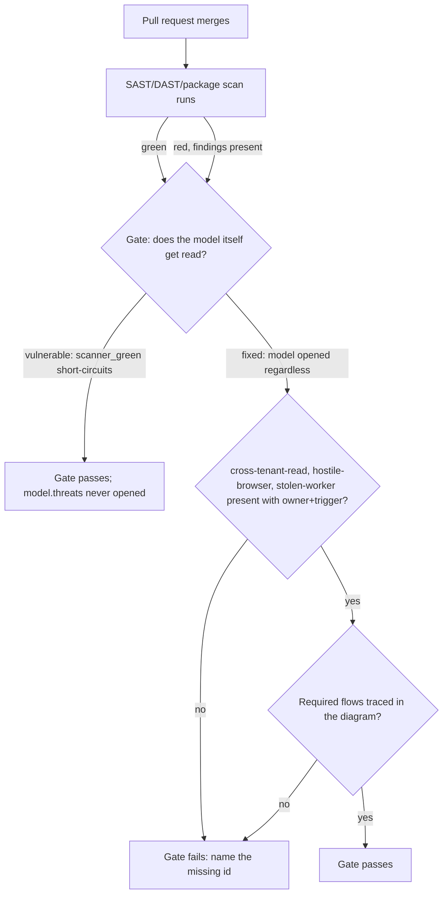

# A green scanner cannot stand in for the versioned model

**Kind:** concept-model
**Loop step:** 1 Property
**Standards:** OWASP ASVS 5.0.0 `v5.0.0-15.1.4` (final, Level 3, labeled advanced), `v5.0.0-15.1.5` (final, Level 3, labeled advanced). OWASP Threat Modeling Project (final, maintained project guidance). NIST SP 800-154 (Initial Public Draft — cited as informative, not final).

## The claim you can prove false

SecureCollab's notes have a body field that another company's member should never read, a browser client that no server code should trust with an identity claim, and — once Phase 7's queues exist — a worker that redelivers a share grant after the fact. None of the three is a pattern a SAST rule, a DAST crawl, or a dependency scan is built to recognize, because none of the three is a code-level defect at all. A cross-tenant read is not a bug in a function; it is the absence of a check the function was never asked to have. Naming a scanner "green" says something true and useful about a different question than the one a threat model answers, and the sentence worth testing states exactly where the two questions diverge:

> For SecureCollab's Phase 3 CI merge gate, an engineer relying on a green SAST/DAST/package scan cannot treat that result as evidence that `cross-tenant-read`, `hostile-browser`, and `stolen-worker` have been considered, because the gate's own check must independently confirm all three are present in the versioned model, each with a named owner and a review trigger, regardless of what the scanner reports. If any of the three is missing, or present with no owner or trigger, the answer is no: the gate must fail, and a scanner result — green or not — cannot change that, because none of the three threats is a pattern any SAST/DAST/package rule matches in the first place.

Read the sentence clause by clause, because a reader who accepts the conclusion without the reasoning will believe a scanner dashboard settles a question it was never asked. "Cannot treat that result as evidence" is the load-bearing phrase: it does not say the scan is worthless, only that it is evidence about a different, narrower claim — did this specific pattern appear in this specific code path — than "has this system's design been walked for what can go wrong." "The gate's own check must independently confirm" locates the fix at the one place that can actually stop the failure: a piece of code that opens the stored model and looks at it, not a document that the merge process never reads. "With a named owner and a review trigger" is the clause every scanner-substitution failure skips, because a bare id string in a list is unfalsifiable — nobody is on the hook for it, and nothing says when to look again. "Regardless of what the scanner reports" is the clause this lesson's lab reproduces directly: the vulnerable fixture returns `pass` the instant `scanner_green` is `True`, and never opens the stored document at all.

A **threat model**, in this lesson's vocabulary, is a versioned, checkable claim about which assets a system must protect, which actors can threaten them, which boundary each threat crosses, and what would prove the claim wrong. "Versioned" and "checkable" are doing real work in that definition, not decoration: a threat model that lives only in a slide deck cannot be diffed, cannot fail a CI run, and cannot show anyone when it was last true. A **scanner**, by contrast, is a tool that pattern-matches known-bad shapes in code, dependencies, or configuration against a fixed rule set. Both are useful. Neither is the other, and the failure this module is about is a system that only ever asked the second question and quietly treated its answer as if it had also answered the first.

## Two ways "green" gets mistaken for "modeled"

A team can run every scanner correctly, act on every finding, and still ship the exact failure this lesson names. Two routes to that outcome are common enough to name individually, because naming them precisely is what separates a team that built a threat model from a team that added a dashboard tile nobody actually reads as a model.

The first route is a threat model that was written once, in a design document, and never turned into anything a machine checks. A reviewer skimming the repository will find a markdown file with STRIDE headings and a data-flow picture — evidence that someone, at some point, thought about the system's boundaries. What that reviewer will not find is any code path that reads the file's content before a pull request merges. The model exists; nothing consults it. The second route is subtler and is the one this module's lab fixture is built to exhibit: a CI job that does open something at merge time, but the something it opens is the scanner's result field, not the model's content. `vulnerable/app.py`'s `evaluate_gate` function looks, at first glance, like exactly the kind of merge check a security-conscious team would be proud of — it runs on every pull request, it can fail a build, and someone clearly wired it into the pipeline on purpose:

```python
def evaluate_gate(model: dict, scanner_green: bool, scanner_findings: list[str]) -> dict:
    if scanner_green:
        return {"gate": "pass", "reasons": [], "scanner_extra_findings": list(scanner_findings)}
    threats = model.get("threats", [])
    if threats:
        return {"gate": "pass", "reasons": [], "scanner_extra_findings": list(scanner_findings)}
    return {"gate": "fail", "reasons": ["no threats recorded and scanner is not green"], ...}
```

Read this function on its own, with no memory of what a threat model is supposed to guarantee, and it looks like an ordinary, defensive merge check: it takes a `model` argument, so surely it does something with it. The defect is not visible inside any single line; it is visible only in the *order* of the two branches. The first `if` returns before the function's own `model` parameter is ever read. A pull request that ships a threat model missing `cross-tenant-read` entirely, with every mandatory row stripped of its owner, passes this gate identically to a pull request with a complete, current model — as long as the scanner happens to be green, which for a well-maintained codebase is most days. A reviewer who asks "does this gate have a model parameter" answers yes. A reviewer who asks "does the common-case code path ever reach the code that reads it" answers no, and the second question is the one this lesson's property is actually about.

Both routes share one underlying mistake: treating "the scanner is green" as a proxy for "the design has been walked for what can go wrong," on the reasoning that a clean scan is at least *some* evidence of care. It is evidence of care about pattern-matched implementation defects. It says nothing about whether anyone asked what a member of another company could do with a note's share grant, because that question has no pattern for a scanner to match — the code that would answer it correctly and the code that would answer it incorrectly can be syntactically identical, differing only in a check that either exists or does not.

## Picture: two questions, one gate, and where they diverge



Two paths meet at `GateCheck` and diverge on a single design decision: does the code that runs next actually open `model.threats`, or does it return before that line executes. The vulnerable path's shortcut is not a missing feature — the model-reading code exists further down the same function — it is a `return` statement placed before it that a scanner's green result reaches every time. The fixed path removes the shortcut, not the scanner check: `scanner_green` is still read, still returned to the caller, still useful as an *additional* signal, but it no longer decides whether the model itself gets opened.

## What must be trusted for this claim, and what changes it

For the claim above to hold, three things have to be true at once, and separating them matters because a design that gets two right and the third wrong still fails. The gate's own code has to actually read `model.threats` on every call, not merely accept a `model` parameter cosmetically. The versioned model file — the thing a human or a threat-modeling session produced — has to be the thing the gate reads, not a copy that has drifted from what is actually in git. And the three always-name ids have to be correctly chosen for *this* system in the first place: `cross-tenant-read`, `hostile-browser`, and `stolen-worker` are the right always-name set for SecureCollab's Phase 3 because they map to the three trust boundaries [1.3](../../../1/1.3/lessons/01-property.md) already established — a public caller becoming a worker, a browser origin being trusted with server-side authority, and a public request path being confused with a server-built worker context — not because three is a magic number every system should use.

Change the claim and this list changes, which is worth demonstrating rather than asserting. If the claim were instead "the model records who approved each accepted risk," the reviewer's identity and timestamp would move onto the trusted list, and the gate's job would shift from checking presence to checking provenance. If the claim were "the scanner itself has no false negatives," none of this lesson's mechanism would matter at all — the entire point of the always-name set is that it does not depend on the scanner being right, wrong, thorough, or lazy. Threat modeling is one property SecureCollab needs among several; the trusted-component list for each property is its own list, not one shared inventory labeled "security review."

## The attacker and platform capabilities this claim survives

Three kinds of capability motivate the always-name set, and stating them precisely matters because a vague "attackers" label would let a reader assume any control counts as covering all three. A **cross-tenant member** — an authenticated user of company B — has a valid session and a valid account; nothing about their traffic looks anomalous to a scanner, because from the platform's perspective they are doing exactly what an authenticated user is supposed to do, just to the wrong company's note. A **hostile browser client** is not a compromised device; it is the ordinary, unremarkable fact that any JavaScript running in a user's browser executes under that user's control, so a server that trusts a client-asserted company id or role is trusting a value the attacker's own browser produced. A **future worker identity**, once Phase 7's queues exist, redelivers a share grant asynchronously, and a worker path answers to no browser request at all — an HTTP-only scan has no request to intercept and no response to inspect, so this capability is invisible to that entire class of tool by construction, not by an oversight in the tool's configuration.

What this claim deliberately does not defend against is worth stating with equal precision. It says nothing about whether the gate's own CI infrastructure has been compromised — a party who can rewrite the gate's code can presumably also rewrite its answer, and that is a supply-chain property owned by [10.2's pipeline hardening](../../../10/10.2/spec.md), not by this module. It also says nothing about whether the mitigations the model names actually work; `cross-tenant-read`'s row can be present, owned, and prioritized while [4.4's `can_read` matrix](../../../4/4.4/spec.md) — the mechanism that mitigation names — has a bug in it. This module's gate checks that the threat was named, traced, and kept current. It does not re-verify the mitigation's implementation, because that verification is a different property with its own evidence, owned by the module that builds the mechanism.

## Why a threat id is not yet the whole claim

A reader who has only ever seen threat modeling presented as "make a STRIDE table" might reasonably conclude that once `cross-tenant-read` appears as a row, the model has done its job for that threat. The next three lessons exist because that conclusion is exactly one clause too generous. [`lessons/02-model.md`](02-model.md) builds the inventory this lesson has only gestured at — which flows exist, which boundary each threat actually crosses, and why a threat id with no traced flow behind it is unfalsifiable rather than merely incomplete. [`lessons/03-break.md`](03-break.md) runs the vulnerable fixture and names the exact line where the scanner's result stops being one signal among several and becomes the only signal read. [`lessons/04-build.md`](04-build.md) derives the fix — a gate that reads the model on every call, ranks its threats, and demands a real mitigation on the highest-priority row, not a rank number by itself. [`lessons/05-verify.md`](05-verify.md) proves the fix holds against a model that looks compliant by every superficial measure but fakes one specific check. [`lessons/06-operate.md`](06-operate.md) and [`lessons/07-transfer.md`](07-transfer.md) carry the same rule to a detection signal that must never back-date a stale model, and to a channel — clinic SMS — that no HTTP scanner enumerates at all.

## What this lesson is not doing

This lesson does not authorize running anything against a production scanner tenant, a real vendor's dashboard, or any system other than the local fixture under `labs/3.2/3.2-lab`. Run this only inside `labs/3.2/3.2-lab/`. Every threat id, owner name, and flow name used throughout is a synthetic fixture value, not a real finding or a real incident, and the lab resets between runs.
