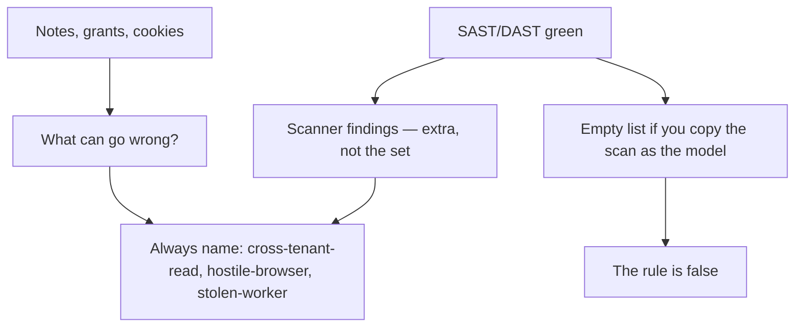
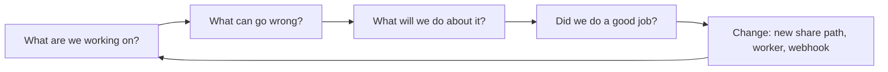

# A green scanner is not an empty threat model

**Kind:** concept-model
**Loop step:** 1 Property

## The rule

The notes app still has a reader from another company. It still has a browser client you do not trust. It will later have a worker that runs with stored grants. None of those are bug names a scanner has to find today.

A green SAST, DAST, or package scan is coverage for implementation bugs that happen to match a rule. It is not a model of what can go wrong for the notes, the grants, and the cookies.

> For the notes app, a threat model you keep in version control must still list `cross-tenant-read`, `hostile-browser`, and `stolen-worker` when every scanner is green. Scanner findings are extra coverage, not the set. STRIDE letters with no assets, no owners, and no “what would prove this row wrong” are not this sentence.

What must not happen is an **empty model on a green scan**. `threats_from_scan(scanner_green=True)` returns `[]`, so `cross-tenant-read` is missing. Then the story of what you already checked looks finished. Who may read a note, and where trust stops, were never even listed.

Awareness lists still say “model the design when it changes.” That is not a passing score you earn by pasting a tool report. Industry lists ask for documented security decisions you can check in the running system. They want dangerous features called out in docs when you claim that bar. Neither sentence is “the scanner was green.”

## Picture: the scanner is coverage, not the model



What you trust is the **versioned list with owners and triggers**, plus the check that those ids exist. The scanner process is not an oracle. FastAPI, Semgrep, and a vendor dashboard do not know `cross-tenant-read`.

**A tool is not the rule.** Threat Dragon, a data-flow picture, or “we did STRIDE in the sprint.” A named product is not this sentence.

## Picture: four questions, not a sticker pack



Those four questions are the method. STRIDE, PASTA, LINDDUN, and attack trees are *prompts* under question two. LINDDUN will matter later for privacy flows. It will not list “someone from another company reads a note” for you.

NIST’s data-centric modeling note is still a **draft**. It says: pick the data, then model attack and defense. That is useful. It still does not replace owners and “when this row is no longer true.”

## Why it happens, what it costs, how you stop it, how you notice, how you recover

| Slice | For this rule |
|---|---|
| Why it happens | Tool output is treated as thinking |
| What has to be true first | `scanner_green=True`; the assembler copies that as “no threats” |
| Trigger | CI or a reviewer asks “what’s in the model?” |
| What it costs | The story of what you checked looks done; who-may-read and where-trust-stops were never listed |
| How you stop it | Seed the threats you must always name; join scanner findings onto that list |
| How you notice | CI fails if required ids, owners, or triggers are missing |
| How you recover | Add the threat, the tests, and an owner; do not pretend the file already had the row |

## What the framework does vs what you still have to check

A “no High findings” ticket is not a threat model. Framework defaults such as HttpOnly cookies and parameterized queries are real later rows. They do not enumerate cross-tenant read.

The app’s promise in this practice: the list still returns `cross-tenant-read` when the scanner is green. The folder is `labs/3.2/3.2-lab`. No live targets. No production scanner tenant.

## What the tool cannot do

- STRIDE stickers on a picture with no “what would prove this row wrong.”
- Moving a threat to “accepted” with nobody left holding it.
- Treating an awareness list or a Top 10 as the threat list.
- A model that lives only on a slide, so nobody can see it age.

## Practice

Name three threats that remain if every CVE is patched. Then run:

```text
python3 -m pytest labs/3.2/3.2-lab/tests --impl vulnerable
python3 -m pytest labs/3.2/3.2-lab/tests --impl fixed
```

The first command must fail. The second must pass. Tie the check to `cross-tenant-read` still present, not to a scanner product name.

## Use it somewhere new

Clinic SMS reminders. The new channel is not in the notes-app HTTP model. Which threats appear that no CVE scanner will list?

## What this page is not doing

Live-target scanning, real personal data in the practice, copy-paste exploits, and “green scan means ship.” Answer keys are not on this site.
