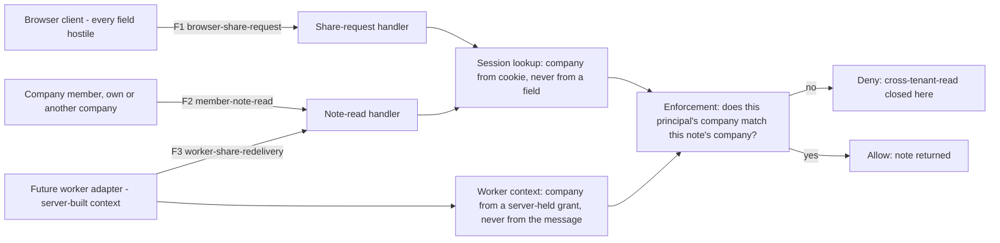

# Naming assets, boundaries, and flows a second engineer can test

**Kind:** design-exercise
**Loop step:** 2 Model

## What a model has to name before "traced" means anything

A data-flow picture with three boxes and two arrows looks, to the person who drew it, like a complete account of the system. It is complete only if every arrow answers six questions at once: who is acting, which identity the system used to decide, where the code runs, how the value travels, where an actor can first change in-scope behavior, and where an assumption changes on the way through. [`lessons/01-property.md`](01-property.md) already showed that a threat id with no traced flow behind it is a label a gate cannot check; this lesson builds the inventory that turns "traced" from a feeling into something a second engineer, or a CI job, can verify by looking at a table.

Carry forward what earlier modules already established for SecureCollab, because this lesson's job is to apply that work to Phase 3's threats, not to redo it. [1.2's access-matrix tuple](../../../1/1.2/lessons/01-property.md) named subjects, actions, objects, and state for *who may do what*; [1.3's trust-boundary work](../../../1/1.3/lessons/01-property.md) named where an assumption changes on a request path; [3.1's classification inventory](../../3.1/lessons/02-model.md) named which fields are assets and which sinks they can reach. This lesson's contribution is the piece none of the three supplies on its own: a named, stable flow id for every path a threat depends on, so that "is this threat traced" becomes "does this flow id appear in the declared-flows list" rather than a matter of impression.

## Naming the pieces without collapsing them

| Word | Precise question | SecureCollab, Phase 3 |
|---|---|---|
| Actor | Who or what takes part? | A member of the note's own company; a member of another company (the cross-tenant threat); the Next.js browser client itself, independent of who is using it; a future worker process (Phase 7) that redelivers a share grant |
| Principal | Which identity is used for a decision? | The session-bound member id and company id, resolved server-side from a cookie — never a client-asserted field; later, a worker identity a server-side adapter constructs, never one a queue message claims about itself |
| Component | Where does the code or data run? | The browser client; the FastAPI share-request handler; the FastAPI note-read handler; later, a worker adapter and the redelivery handler it calls |
| Channel | How does the value travel? | An HTTPS request now; a queued message later, once Phase 7's worker exists |
| Entry point | Where can an actor first change in-scope behavior? | The share-request endpoint (who can create a grant); the note-read endpoint (who can read a note by id); later, the worker's redelivery entry (what a redelivered message is allowed to do) |
| Trust boundary | Where does a relevant assumption change? | Browser to API: a client-asserted company or role field becomes untrusted input the moment it crosses this line. API to another company's note: "this session is valid" stops meaning "this session may read this note" without an explicit company match. Server to worker adapter: worker identity must come from server-held state, never from anything the redelivered message itself asserts |
| Flow id | The stable name this model's gate checks for | `browser-share-request`, `member-note-read`, `worker-share-redelivery` — one per always-name threat, so a missing id in `declared_flows` names exactly which threat's tracing is incomplete |

Keep these seven words from collapsing into each other, because two pairs are easy to confuse in exactly the way that produces an untraceable model. **Actor** and **principal** are not the same category: the actor "a member of another company" and the principal "the session-bound company id" are related but distinct, and the distinction is why `cross-tenant-read`'s mitigation cannot be "check that the actor is logged in" — a logged-in actor from company B is still the wrong principal for company A's note, and only a check against the *principal*, not against "is anyone authenticated at all," closes the threat. **Entry point** and **flow id** are not the same either: an entry point is a place in the code; a flow id is a name this model gives to the path from an actor through that entry point to a protected effect, and a system can have one entry point serving two flows (the note-read endpoint serves both the "own company" flow and the "cross-tenant" flow, and only one of the two is supposed to succeed).

## First worked discrimination: a new layer that is not a new boundary

Suppose a teammate proposes adding a second route, `/api/notes/read-v2`, that trims whitespace and enforces a maximum length on the incoming note id before calling the existing `read_note` handler underneath:

```python
@app.get("/api/notes/read-v2")
def read_note_v2(note_id: str, authorization: str | None = Header(default=None)):
    """A cleaner, validated entry point for note reads."""
    clean_id = note_id.strip()[:64]
    return read_note(clean_id, authorization=authorization)
```

On an architecture diagram, this looks like progress: a new route, a docstring that mentions validation, a layer that suggests someone thought about input handling as its own concern. Ask the only question this lesson's property makes relevant: does anything about `read_note_v2` change which company a session resolves to, or which note id a caller may read? Trimming whitespace and truncating length are real transformations, and they may well prevent a different class of bug — but neither one touches the session lookup or the cross-tenant check inside `read_note`, which receives the same `authorization` header and performs the same lookup regardless of which route called it. If `read_note_v2` does not itself resolve a *different* principal or enforce a *different* company match before delegating, the answer is no — a member of company B reaches exactly the same cross-tenant exposure through the new route that they would through the old one, wearing a cleaner url on the way. A box on a diagram is evidence that someone wrote code, not evidence that an assumption changed. This is [1.3's transparent-relay lesson](../../../1/1.3/lessons/01-property.md) again, applied here to an application-layer wrapper instead of a network hop: a hop that changes no assumption is not a boundary, however real the extra route is.

## Second worked discrimination: a boundary that does not look like one

Now take the case Phase 7 will eventually build: a share grant that a worker redelivers asynchronously instead of the original requester waiting for a synchronous response. A team member reasonably argues that this changes nothing security-relevant, because "the worker just calls the same `read_note` function the API calls — same code, same checks." Look at *how* the worker's call constructs the value that `read_note` treats as the caller's company, and the argument falls apart. The API path resolves company from a session lookup keyed to a cookie the browser presented and the server issued; nothing in that path lets a caller simply state their company as a field. A worker path calling the identical function needs *some* value to pass as company, and if the fastest way to wire that up is to read a `company_id` field off the queued message itself — because the message already carries one, put there by whoever created the share grant — an untrusted-until-verified value has just occupied the position the browser path never let anything but a server-resolved session occupy. The function is the same. The code path is the same. The boundary crossed is not the same, because the *provenance* of the value feeding it changed from "server looked it up" to "the message claims it," and a compromised or malformed message can now claim anything. This boundary is invisible on a diagram that only draws function calls, because a function-call diagram shows *that* a value arrived, not *how* it was produced — which is exactly why `worker-share-redelivery` needs its own flow id rather than being folded into `member-note-read` as "the same check, called from a different place."

## Picture: three flows, one enforcement point, three different sources of authority



All three flows converge on one `Enforce` step, but each supplies its principal through a different mechanism, and the diagram's job is to make that difference visible rather than to make the three boxes look interchangeable. A model that draws `F1` and `F2` but never draws `F3` has not merely omitted a box; it has left the gate with no way to tell whether `stolen-worker`'s coverage claim means anything, because there is no declared flow for the check to point at.

## What can change between the check and the use

Two windows matter for this module specifically, and neither one is visible from a single snapshot of the diagram. Between when a share grant is **issued** and when a worker **redelivers** it, the grant's own state can change — it can be consumed, revoked, or expired — so a worker path that checks grant validity once, at issuance, rather than again at redelivery, has left a gap the diagram alone will not reveal; that gap is [4.4's authorization matrix](../../../4/4.4/spec.md) to close, but this module's threat model has to name it as a boundary worth tracing before 4.4 can be asked to close it. Between when a named review trigger **fires** — a new share path ships — and when a threat row's `revisited_after` is actually **updated**, the model itself can be stale for an arbitrary window, and nothing about a green CI run during that window proves the window is short. [`lessons/06-operate.md`](06-operate.md) turns that second window into a detection signal; this lesson's job is only to name it as a state transition the model has to represent, not to close it.

## Practice

Using the table above, add a row for a new actor: a support engineer investigating a stuck redelivery, who queries the worker adapter's internal state directly rather than going through either API route. Name that actor's principal, entry point, and trust boundary, and decide whether this scenario needs a fourth flow id in `declared_flows` or is already covered by `worker-share-redelivery`. Then trace `member-note-read` end to end for the denied case — a member of company B requesting company A's note — and write, in one sentence, the exact field comparison that must return false for the deny to hold.

## Use it somewhere new

Clinic SMS reminders add a new actor this table has no row for: the SMS gateway vendor, sitting on the wire between the clinic's API and the patient's handset. Before [`lessons/07-transfer.md`](07-transfer.md) asks you to write the flow list for it, predict which of this table's seven columns changes first when that actor is added, and whether the vendor's own "HIPAA certified" claim substitutes for any cell in this table or for none of them.

## What this lesson is not doing

This lesson models SecureCollab's Phase 3 flows as they exist in the local lab fixture and in the blueprint's Phase 7 plan; it does not claim a deployed queue, a real worker fleet, or a production session store. Do not run this inventory exercise against a real vendor's dashboard, a real clinic's system, or any log drain or queue outside `labs/3.2/3.2-lab`.
