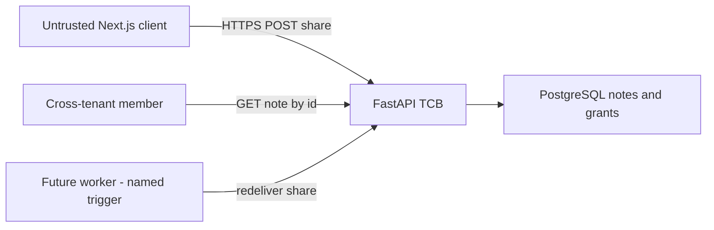
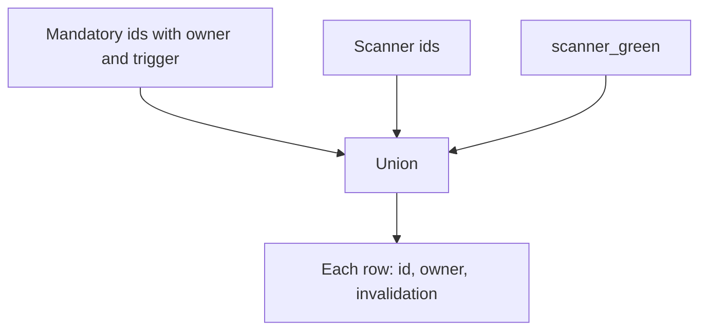

# 3.2-LO-02 — A model a second engineer can test

**Kind:** design-exercise
**Loop step:** 2 Model
**Standards:** OWASP Threat Modeling Project (maintained) Four Questions; OWASP ASVS 5.0.0 (final) `v5.0.0-15.1.3`; NIST SP 800-154 IPD remains **draft**.

## Can a second engineer name pytest cases from your model?

A page of STRIDE letters is not this lesson. A reviewable model names **assets**, **flows**, **trust boundaries**, **threat ids**, **owners**, and **what would falsify each row**.

SecureCollab Phase 1 freeze: note body and id, share grant, session cookie, local `assemble_threat_model` fixture. No real Threat Dragon cloud, no production Jira.

## Mental model: data flow with one hostile hop

Question one (“what are we working on?”) is this diagram plus classification from 3.1. If the worker is missing, 7.4 will invent authority later and the model will be silently stale.

## Mental model: mandatory seed plus additive findings

`scanner_green` does not delete the seed. Scanner ids may append. A missing owner is how “accepted risk” becomes nobody’s job.

## Step 1: freeze pieces

| Piece | This system |
|---|---|
| Subjects | Modeler; scanner; reviewer; CI; cross-tenant member; hostile browser; future worker |
| Objects | Threat list; scan status; DFD; share grant; note body |
| Actions | `assemble_threat_model`; merge; share; read |
| Channels | Git threat-model markdown; CI; HTTPS |
| TCB | Versioned model with owners and triggers; FastAPI grant checks (1.2) |
| Untrusted | Scanner empty-result; “no High findings”; the Next.js bundle |
| State / time | Model stale after a new share path, webhook (7.3), or worker identity (7.4) |
| 1.1 cell | Integrity of the assurance story |

## Step 2: write cells

| Subject | Object | Action | Decision |
|---|---|---|---|
| modeler | `cross-tenant-read` | must-list | allow-item |
| scanner | empty list | replace-model | deny |
| reviewer | stale model | merge | deny |
| CI | mandatory ids | gate | allow |
| worker | share grant | execute | named trigger, not silent omit |

A missing cell is how ambient “the scanner covered it” appears.

## Step 3: reviewable backlog

Each mandatory id needs: asset, attacker, boundary, invalidation test, owner, trigger. SP 800-154 (draft) would start from the note body as data; you still owe the grant graph and the cookie jar (2.3).

## Practice

Draw this map so a second engineer could name pytest cases. Point at `labs/3.2/3.2-lab` file `model.py`.

## Transfer

Add webhooks (7.3): which new threat ids, owners, and triggers?

## Residual risk

Unknown unknowns. Review triggers exist for that. LINDDUN waits for 5.1 and still will not list IDOR.

## Non-goals

Top 10 as the definition of security. Keys stay out of lessons.
