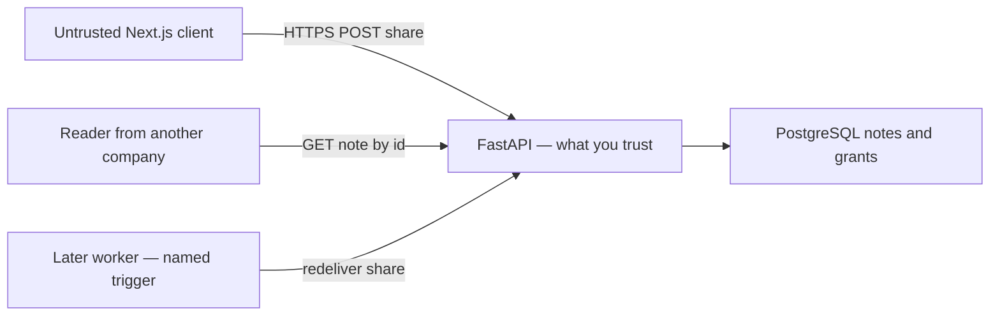
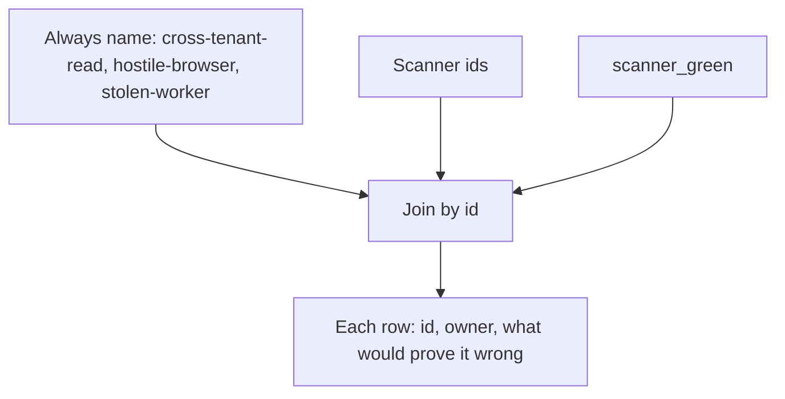

# A model someone else can test

**Kind:** design-exercise
**Loop step:** 2 Model

## Could someone else name checks from your model?

A page of STRIDE letters is not this page. A reviewable model names **assets**, **flows**, **trust boundaries**, **threat ids**, **owners**, and **what would prove each row wrong**.

This week’s freeze: note body and id, share grant, session cookie, a local `assemble_threat_model` practice. No real Threat Dragon cloud. No production ticket tracker.

## Picture: data flow with one hostile hop

Question one (“what are we working on?”) is this diagram plus the labels from classification work. If the worker is missing, a later queue will invent authority and the model will go stale in silence.

## Picture: always-name list plus extra findings

`scanner_green` does not delete the always-name list. Scanner ids may append. A missing owner is how “accepted risk” becomes nobody’s job.

## Step 1: freeze who, what, and time

| Piece | This system |
|---|---|
| Who | Modeler; scanner; reviewer; CI; reader from another company; hostile browser; later worker |
| What | Threat list; scan status; data-flow picture; share grant; note body |
| Actions | `assemble_threat_model`; merge; share; read |
| Paths | Git threat-model markdown; CI; HTTPS |
| What you trust | Versioned model with owners and triggers; FastAPI grant checks |
| What you do not trust | Scanner empty-result; “no High findings”; the Next.js bundle |
| State / time | Model stale after a new share path, a webhook, or a worker identity |
| The rule | The story of what you checked stays honest |

## Step 2: write rows the lab can fail

| Who | What | Action | Decision |
|---|---|---|---|
| modeler | `cross-tenant-read` | must still list | allow this row |
| scanner | empty list | replace the model | deny |
| reviewer | stale model | merge | deny |
| CI | always-name ids | gate | allow |
| worker | share grant | execute | named trigger, not a silent omit |

A missing row is how ambient “the scanner covered it” appears.

## Step 3: a backlog someone else can check

Each always-name id (`cross-tenant-read`, `hostile-browser`, `stolen-worker`) needs: asset, attacker, boundary, a test that would prove the row wrong, owner, trigger. The draft data-centric note would start from the note body as data. You still owe the grant graph and the cookie jar.

## Practice

Draw this map so someone else could name the checks. Point at `labs/3.2/3.2-lab` file `model.py`.

## Use it somewhere new

Add webhooks later. Which new threat ids, owners, and triggers?

## What can still go wrong

Unknown unknowns. Review triggers exist for that. Privacy-method stickers wait for later privacy work. They still will not list “someone from another company reads a note.”

## What this page is not doing

Treating a Top 10 as the definition of security. Answer keys are not on this site.
