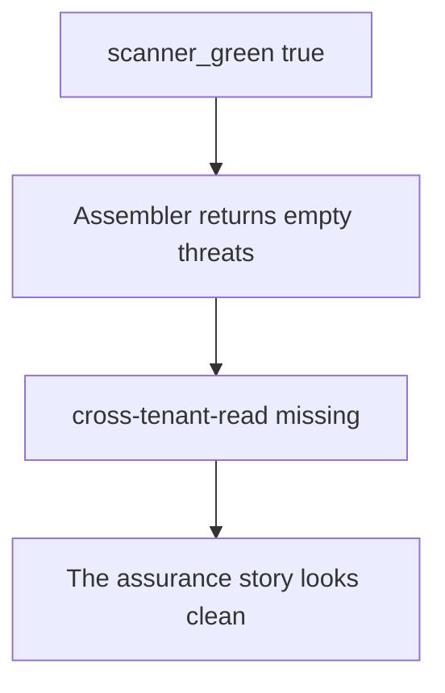

# Practice: a green scanner produces an empty threat model

**Kind:** mechanism-lab
**Loop step:** 3 Break

## Try it

The practice is not a website you attack. `assemble_threat_model` does not open a scanner tenant, a Semgrep cloud org, or a production dashboard. Fake threat ids only. An empty list is already the miss, not a clean bill of health.

> A green scan still lists `cross-tenant-read`. `threats_from_scan(True)` must not return `[]`.

## Where you may practice

Stay inside `labs/3.2/3.2-lab`. Do not run SAST or DAST against a public host, an employer repo, or a classmate preview as this exercise.

What must not happen: a green scanner produces an empty notes-app threat model. `threats_from_scan(True)` returns `[]`, so `cross-tenant-read` is missing.

Who could do this: a reviewer or CI job that can ask “what’s in the model?” after `scanner_green=True`. That stands in for a “no High findings” ticket, a Threat Dragon picture, or “we did STRIDE in the sprint.” What is supposed to stop this: the assembler **seeds** design threats that no CVE rule will list. FastAPI, Semgrep, and a vendor dashboard are not enough.

## Picture: green copies empty



Tool output is treated as thinking — not a dump of a vendor report. `scanner_green` is true; the assembler returns `{"threats": []}`. You do not need a live scan. You must not point a scanner at someone else’s system.

A green dashboard is a tool observation. It is not documented security decisions you can check.

## What to look at: the cause, not a hunt

In `vulnerable/model.py`, `assemble_threat_model` returns an empty list when `scanner_green` is true. `threats_from_scan(True)` is therefore empty. Checks:

- `test_green_scanner_is_not_an_empty_threat_model` — `cross-tenant-read` must be present
- `test_mandatory_threats_have_owners_and_triggers` — `cross-tenant-read`, `hostile-browser`, and `stolen-worker` each have `owner` and `trigger`
- `test_scanner_findings_are_additive` — extras join; they do not replace the seed

You do not need a new CVE id.
## Why it happens, what it costs, how you stop it, how you notice, how you recover

| Slice | This practice |
|---|---|
| The rule | A green scan still lists `cross-tenant-read` |
| Why it happens | Tool output is treated as thinking |
| What has to be true first | `scanner_green=True`; the assembler copies that as “no threats” |
| Trigger | `threats_from_scan(True)` |
| What it costs | The story of what you checked looks done; who-may-read was never listed |
| How you stop it | Seed the threats you must always name; join scanner findings onto that list |
| How you notice | CI fails if required ids, owners, or triggers are missing |
| How you recover | Add the threat, the tests, and an owner; do not pretend the file already had the row |
| Not the lesson | A scanner product name, a Top 10 mnemonic, or an awareness list as a passing score |

## What the framework does vs what you still have to check

A “no High findings” ticket is not a threat model. HttpOnly cookies and parameterized queries are real later rows. They do not enumerate cross-tenant read. The helper still returns `cross-tenant-read` when the scanner is green.

## Practice

```text
python3 -m pytest labs/3.2/3.2-lab/tests --impl vulnerable
```

Record the failing tests, starting with `test_green_scanner_is_not_an_empty_threat_model`. Do not weaken them to “a threats key exists.” A setup error is not proof the rule holds.

## Use it somewhere new

Clinic SMS reminders. Predict an empty model if the only input is “SMS gateway vendor scan green.” Stay in this directory. Do not scan a clinic or a carrier.

## What this page is not doing

No live-target scanning. Fake ids only. Do not paste a real vendor report into the lesson.
