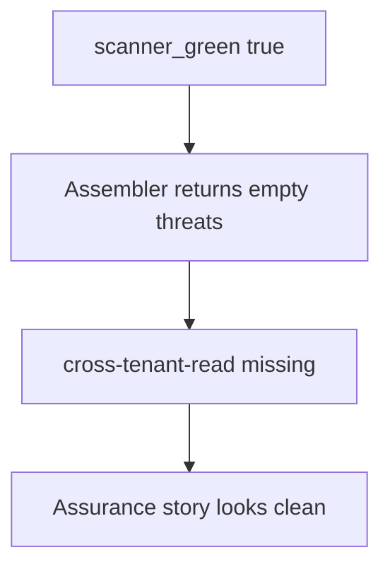

# 3.2-LO-03 — Observe the empty list, do not trophy a scanner

**Kind:** mechanism-lab
**Loop step:** 3 Break
**Standards:** OWASP Threat Modeling Project (maintained guidance); OWASP ASVS 5.0.0 (final) `v5.0.0-15.1.3`. ASVS Appendix D is process **awareness**, not this oracle. NIST SP 800-154 IPD remains **draft**.

## Authorized scope

`labs/3.2/3.2-lab` only. The fixture is an in-process `assemble_threat_model` dict. Synthetic threat ids. It does not open a scanner tenant, a Semgrep cloud org, or a production dashboard. Do not run SAST/DAST against a public host, an employer repo, or a classmate preview as this exercise.

**Forbidden outcome:** a green scanner produces an empty SecureCollab threat model. `threats_from_scan(True)` returns `[]`, so `cross-tenant-read` is missing.

Attacker capability in this lab: a reviewer or CI job that can ask “what’s in the model?” after `scanner_green=True`. That stands in for a “no High findings” ticket, a Threat Dragon PNG, or “we did STRIDE in the sprint.” Trust assumption: the assembler is supposed to **seed** design threats that no CVE rule will list. FastAPI, Semgrep, and a vendor dashboard are not in the TCB for this cell.

## Mental model: green copies empty



The vulnerable tree demonstrates **cause** (tool output substituted for thinking), not a trophy dump of a vendor report. Preconditions: `scanner_green` is true; the assembler returns `{"threats": []}`. You do not need a live scan. You must not point a scanner at a third-party target.

ASVS `v5.0.0-15.1.3` wants documented security decisions you can verify in the running system. A green dashboard is a mechanism observation, not that document.

## What to read in the fixture

`vulnerable/model.py` `assemble_threat_model` returns an empty list when `scanner_green` is true. `threats_from_scan(True)` is therefore empty. Tests:

- `test_green_scanner_is_not_an_empty_threat_model` — `cross-tenant-read` must be present
- `test_mandatory_threats_have_owners_and_triggers` — each mandatory row has `owner` and `trigger`
- `test_scanner_findings_are_additive` — extras union; they do not replace the seed

You do not need a new CVE id. The failure of `test_green_scanner_is_not_an_empty_threat_model` *is* the evidence.

Do not open the fixed tree yet. Diagnose the cause first.

## Root cause vs impact vs prevention vs detection vs recovery

| Slice | This lab |
|---|---|
| Required property | Green scan still lists `cross-tenant-read` |
| Root cause | Tool output substituted for thinking |
| Preconditions | `scanner_green=True`; assembler copies that as “no threats” |
| Trigger | `threats_from_scan(True)` |
| Impact | Integrity of the assurance story: 1.2 / 1.3 cells look done while untested |
| Prevention | Seed mandatory threats; union scanner findings |
| Detection | CI fails if required ids, owners, or triggers are missing |
| Recovery | Add the threat, tests, and owner; do not back-date the file |
| Not the lesson | A scanner product name, Top 10 mnemonic, or Appendix D as a passing ID |

## Framework defaults versus the model guarantee

A “no High findings” ticket is not a threat model. Framework secure-defaults (HttpOnly, parameterized queries) are 2.3 / 6.1 mechanisms; they do not enumerate cross-tenant read. The application guarantee is: **this** fixture still returns `cross-tenant-read` when the scanner is green.

## Practice

```text
python3 -m pytest labs/3.2/3.2-lab/tests --impl vulnerable
```

Record the failing tests, starting with `test_green_scanner_is_not_an_empty_threat_model`. Do not weaken them to “a threats key exists.” An environment error is not security evidence.

## Transfer

Clinic SMS reminders: predict an empty model if the only input is “SMS gateway vendor scan green.” Stay in this directory. Do not scan a clinic or a carrier.

## Non-goals

No live-target scanning. Synthetic ids only. Do not paste a real vendor report into the lesson.
