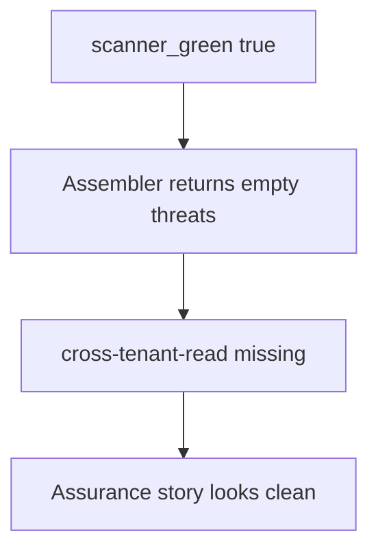

# 3.2-LO-03 — Observe the empty list, do not trophy a scanner

**Kind:** mechanism-lab
**Loop step:** 3 Break
**Standards:** OWASP Threat Modeling Project (maintained); OWASP ASVS 5.0.0 (final) `v5.0.0-15.1.3`.

## Authorized scope

`labs/3.2/3.2-lab` only. Synthetic threat ids. No production scanners, no live tenants.

**Forbidden outcome:** A green scanner produces an empty SecureCollab threat model.

## Mental model: green copies empty



The vulnerable tree demonstrates **cause** (tool output substituted for thinking), not a trophy dump of a vendor report.

## What to read in the fixture

`vulnerable/model.py` `assemble_threat_model` returns `{"threats": []}` when `scanner_green` is true. `threats_from_scan(True)` is therefore empty. The tests assert `cross-tenant-read` is present, that mandatory rows have owner and trigger, and that scanner findings are additive rather than a replacement set.

## Root cause vs impact

| Slice | Lab |
|---|---|
| Root cause | Tool output substituted for thinking |
| Impact | No test for 1.2; residual unowned |
| Not the lesson | A scanner product name or Top 10 mnemonic as the definition |

## Practice

```
python3 -m pytest labs/3.2/3.2-lab/tests --impl vulnerable
```

Record the failing tests, starting with `test_green_scanner_is_not_an_empty_threat_model`. Do not weaken them to “a threats key exists.”

## Transfer

Clinic SMS: predict an empty model if the only input is “SMS gateway vendor scan green.” Stay in this directory.

## Non-goals

No live-target instructions. Synthetic data only.
