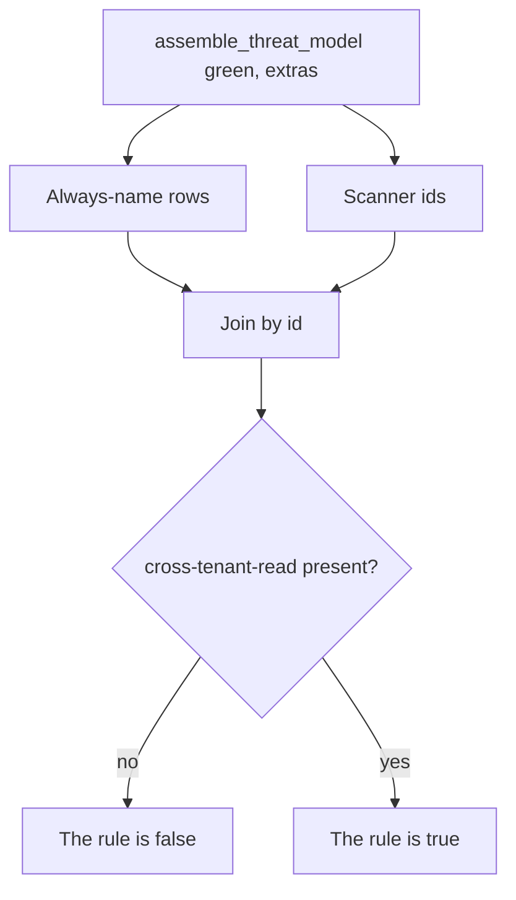

# Seed the threats you must always name

**Kind:** design-exercise
**Loop step:** 4 Build

## The rule

`assemble_threat_model` must still emit `cross-tenant-read`, `hostile-browser`, and `stolen-worker` with owner and trigger when the scanner is green. Structural means the assembler **joins** an always-name set with scanner findings — not a denylist of yesterday’s CVE, not “trust the dashboard,” not a STRIDE sticker with no row, not an awareness list cited as a passing score.

The smallest restore for the notes app is: always write the three always-name rows, then append scanner ids that are not already present. If you are unsure whether a design threat is “in scope,” keep the row and name what is left — do not delete it because the scan was clean.

## Picture: seed then join



The lab’s repaired files always include the three always-name ids with `owner` and `trigger`. Scanner findings append if new. What you trust is that versioned list, plus the check that those ids exist. Threat Dragon, a data-flow picture, and Semgrep are not oracles.

Industry lists ask for documented security decisions. This week's check is the one that covers three notes-app ids, not a complete future catalogue.

## What the repaired files must show

| After the fix | Must be true |
|---|---|
| Green scan | `cross-tenant-read` in the id list |
| Each always-name id (`cross-tenant-read`, `hostile-browser`, `stolen-worker`) | has `owner` and `trigger` |
| Scanner extras | do not drop the seed (`cve-extra` may appear *and* the seed remains) |

## What this is not

STRIDE letters without assets. A privacy method that auto-lists “someone from another company reads a note.” An awareness list treated as a passing score. Back-dating the markdown after an incident. A Top 10 as the threat list. A **draft** data-centric note as a substitute for owners.

## What can still go wrong

- Unknown unknowns remain. The seed is not completeness.
- Models age. A new share path, worker, or webhook is a named trigger, not present code.
- Moving a row to “accepted” with nobody left holding it reopens the story of what you checked.
- A model that is not in version control cannot fail CI.
- Calling out dangerous features in docs is a sister bar, not this check.

## Practice

Name who (assembler / CI), what (threat-id list), and the check (`cross-tenant-read` present on green). Run:

```text
python3 -m pytest labs/3.2/3.2-lab/tests --impl fixed
```

It must pass.

## Use it somewhere new

A clinic example: seed `sms-content-leak` and `number-swap` even if the gateway vendor’s questionnaire is green. HIPAA stickers and vendor scans are not those rows.

## What this page is not doing

Do not connect a production scanner. Do not claim a course gate from a green join.
