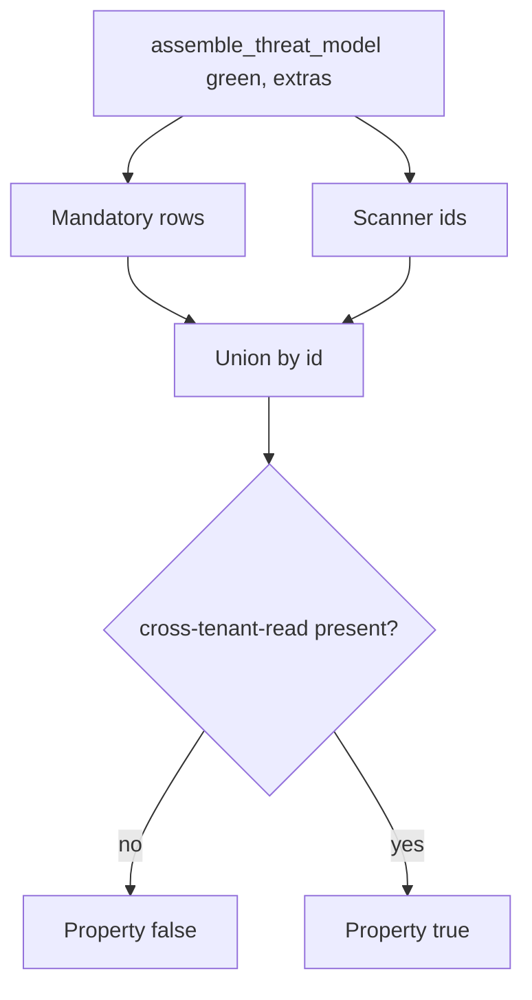

# 3.2-LO-04 — Seed mandatory threats; union scanner extras

**Kind:** design-exercise
**Loop step:** 4 Build
**Standards:** OWASP Threat Modeling Project (maintained) Four Question Framework; OWASP ASVS 5.0.0 (final) `v5.0.0-15.1.3`. `v5.0.0-15.1.5` is **Level 3, advanced** (dangerous-functionality documentation), not this pytest.

## Structural means the seed cannot disappear

`assemble_threat_model` must still emit `cross-tenant-read`, `hostile-browser`, and `stolen-worker` with owner and trigger when the scanner is green. Structural means the assembler **unions** a mandatory set with scanner findings — not a denylist of yesterday’s CVE, not “trust the dashboard,” not a STRIDE sticker with no row, not Appendix D cited as a passing requirement id.

The smallest restore for SecureCollab Phase 1 is: always write the three mandatory rows, then append scanner ids that are not already present. Fail-safe: if you are unsure whether a design threat is “in scope,” keep the row and name the residual — do not delete it because the scan was clean.

## Mental model: seed then union



The lab’s fixed tree always includes the three mandatory ids with `owner` and `trigger`. Scanner findings append if new. The TCB is that versioned list, plus the CI gate that those ids exist. Threat Dragon, a DFD PNG, and Semgrep are untrusted as oracles.

ASVS `v5.0.0-15.1.3` (Level 2) wants documented security decisions. This pytest is that sentence for three Phase 1 ids, not a complete future catalogue.

## Why this restores the cell

| After the fix | Must be true |
|---|---|
| Green scan | `cross-tenant-read` in the id list |
| Each mandatory id | has `owner` and `trigger` |
| Scanner extras | do not drop the seed (`cve-extra` may appear *and* the seed remains) |

## What this is not

STRIDE letters without assets. LINDDUN auto-listing IDOR (5.1). ASVS Appendix D treated as a passing requirement id. Back-dating the markdown after an incident. Top 10 as the threat list. SP 800-154 (draft) as a substitute for owners.

## Mechanism limits

- Unknown unknowns remain; the seed is not completeness.
- Models age: a new share path, worker, or webhook is a named trigger, not present code.
- Moving a row to “accepted” with no residual owner reopens 1.1 integrity of the assurance story (E6).
- A model that is not in git cannot fail CI.

## Practice

Name subject (assembler / CI), object (threat-id list), and the predicate (`cross-tenant-read` present on green). Run:

```text
python3 -m pytest labs/3.2/3.2-lab/tests --impl fixed
```

Must pass.

## Transfer

Clinic: seed `sms-content-leak` and `number-swap` even if the gateway vendor’s questionnaire is green. HIPAA stickers and vendor scans are not those rows.

## Residual risk

Unknown unknowns; models age; workers and webhooks are named triggers, not present code; `v5.0.0-15.1.5` advanced documentation of dangerous functionality is a sister cell.

## Non-goals

Do not connect a production scanner. Do not claim Gate 3 from a green union.
