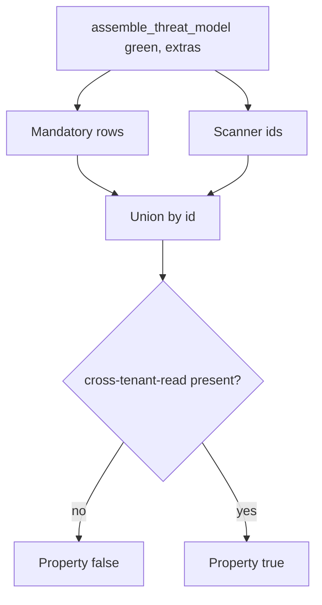

# 3.2-LO-04 — Seed mandatory threats; union scanner extras

**Kind:** design-exercise
**Loop step:** 4 Build
**Standards:** OWASP Threat Modeling Project (maintained); OWASP ASVS 5.0.0 (final) `v5.0.0-15.1.3`.

## Structural means the seed cannot disappear

`assemble_threat_model` must still emit `cross-tenant-read`, `hostile-browser`, and `stolen-worker` with owner and trigger when the scanner is green. Structural means the assembler **unions** a mandatory set with scanner findings — not a denylist of yesterday’s CVE, not “trust the dashboard,” not a STRIDE sticker with no row.

## Mental model: seed then union



The lab’s fixed tree always includes the three mandatory ids. Scanner findings append if new. Fail-safe: if you are unsure whether a design threat is “in scope,” keep the row and name the residual — do not delete it because the scan was clean.

## Why this restores the cell

| After the fix | Must be true |
|---|---|
| Green scan | `cross-tenant-read` in the id list |
| Each mandatory id | has `owner` and `trigger` |
| Scanner extras | do not drop the seed |

## What this is not

STRIDE letters without assets. LINDDUN auto-listing IDOR. ASVS Appendix D treated as a passing requirement id. Back-dating the markdown after an incident.

## Practice

Name subject, object, and the predicate that must be true after the fix. Run:

```
python3 -m pytest labs/3.2/3.2-lab/tests --impl fixed
```

Must pass.

## Transfer

Clinic: seed `sms-content-leak` and `number-swap` even if the gateway vendor’s questionnaire is green.

## Residual risk

Unknown unknowns; models age; workers and webhooks are named triggers, not present code.
