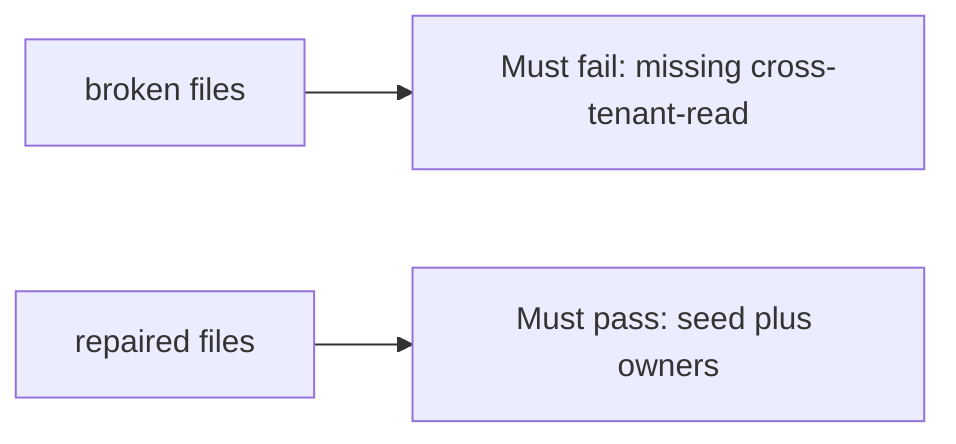

# Fail on the broken files, then pass on the repaired ones

**Kind:** verification-lab
**Loop step:** 5 Verify

## If you cannot test it, it is still a slogan

“We threat-modeled in the sprint” is not evidence. “Scanner was green” is a tool observation. The check is: `threats_from_scan(True)` contains `cross-tenant-read`. That observation must be **false** on the broken files and **true** on the repaired files.

## Picture: missing cross-tenant-read must fail

A test that only counts collection size can pass while `cross-tenant-read` is gone. This check asks whether an empty model on a green scan still counts as a passing control. Broken must fail that question. Repaired must pass it.



| Mode | Must show for this topic |
|---|---|
| Normal | After the fix, `cross-tenant-read`, `hostile-browser`, and `stolen-worker` still have `owner` and `trigger` |
| Wrong input / abuse | Green scan still lists `cross-tenant-read`; broken files must fail that check |
| Additive | Scanner extras (`cve-extra`) do not replace the seed |
| Not claimed | Completeness of all future threats; production scanner SaaS; STRIDE facilitation quality |

Lab tests live in `labs/3.2/3.2-lab/tests/test_property.py`. `test_green_scanner_is_not_an_empty_threat_model` is a **what-must-not-happen** test: an empty model on a green scan is not allowed to count as a passing control.

```text
python3 -m pytest labs/3.2/3.2-lab/tests --impl vulnerable
python3 -m pytest labs/3.2/3.2-lab/tests --impl fixed
```

Map each test to a row you wrote on the model page. If the broken files do not fail the missing-id check, the lab is miswired — fix the wiring, not the check. An environment error is not security evidence.

## What the tests do not prove

- That STRIDE was facilitated well
- Webhook or SMS threats (use-it-somewhere-new)
- That an awareness list is “compliant”
- Production scanner coverage
- That `stolen-worker` is implemented (the worker is later work)

Record those as leftover or later topics, not as silent passes.

## Practice

Run both this session. Write the fail/pass pair next to the matrix row. Reject a “test” that only greps `STRIDE` in a markdown file without calling `threats_from_scan(True)`.

## Use it somewhere new

Clinic SMS. A test that only asserts HTTP 200 is not threat-model evidence. A test that scans a live clinic is out of scope.

## What this page is not doing

Do not add a live scanner tenant. Do not log note bodies. Answer keys stay out of this file.
