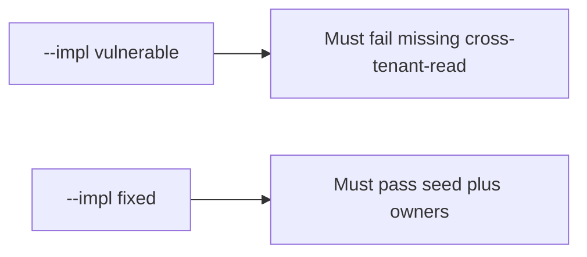

# 3.2-LO-05 — Evidence is a missing id, then a passing pair

**Kind:** verification-lab
**Loop step:** 5 Verify
**Standards:** OWASP ASVS 5.0.0 (final) `v5.0.0-15.1.3`.

## An invariant that cannot fail a test is still a slogan

“We threat-modeled in the sprint” is not evidence. The oracle is the local pair.

## Mental model: vulnerable must fail: missing cross-tenant-read

The failing observation on `--impl vulnerable` is **missing cross-tenant-read**. A passing collection count is not this cell.



| Case | Must show |
|---|---|
| Negative / abuse | Green scan still lists `cross-tenant-read` |
| Structure | Mandatory rows have owner and trigger |
| Additive | Scanner extras do not replace the seed |
| Not claimed | Completeness of all future threats; production scanner SaaS |

Lab tests in `labs/3.2/3.2-lab/tests/test_property.py`:

```
python3 -m pytest labs/3.2/3.2-lab/tests --impl vulnerable
python3 -m pytest labs/3.2/3.2-lab/tests --impl fixed
```

## What the tests do not prove

- That STRIDE was facilitated well
- Webhook or SMS threats (transfer)
- That ASVS Appendix D is “compliant”

## Practice

Execute both implementations. Map each test to an LO-02 cell.

## Transfer

Clinic SMS. A test that only asserts HTTP 200 is not threat-model evidence (see 9.3).
