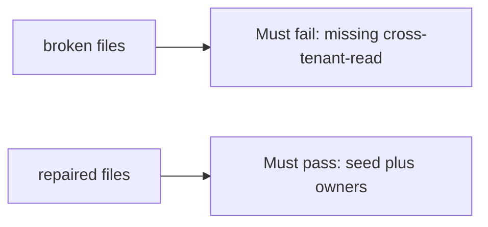

# A missing cross-company check must fail

**Kind:** verification-lab
**Loop step:** 5 Verify

## Check it

A sprint that “did threat modeling” does not name the leftover read. A green scanner tile is a score. `threats_from_scan(True)` still has to contain `cross-tenant-read`. Broken: that row is missing. Repair still lists `cross-tenant-read` on a green scan.

## Picture: missing cross-tenant-read must fail

A check that only counts collection size can still hide that `cross-tenant-read` is gone.



| Mode | Must show for this topic |
|---|---|
| Normal | After the fix, `cross-tenant-read`, `hostile-browser`, and `stolen-worker` still have `owner` and `trigger` |
| Wrong input / abuse | Green scan still lists `cross-tenant-read`; broken files must fail that check |
| Additive | Scanner extras (`cve-extra`) do not replace the seed |
| Not claimed | Completeness of all future threats; production scanner SaaS; STRIDE facilitation quality |

Lab tests live in `labs/3.2/3.2-lab/tests/test_property.py`. `test_green_scanner_is_not_an_empty_threat_model` is there so an empty model on a green scan still fails.

```text
python3 -m pytest labs/3.2/3.2-lab/tests --impl vulnerable
python3 -m pytest labs/3.2/3.2-lab/tests --impl fixed
```

Map each test to a row you wrote on the model page. If the broken files do not fail the missing-id check, the lab is miswired — fix the wiring, not the check. A setup error is not proof the rule holds.

## What the tests do not prove

- That STRIDE was facilitated well
- Webhook or SMS threats (use-it-somewhere-new)
- That an awareness list is “compliant”
- Production scanner coverage
- That `stolen-worker` is implemented (the worker is later work)

## Practice

Call `threats_from_scan(True)`. A `STRIDE` heading in markdown is a sticker, not `cross-tenant-read`.

## Use it somewhere new

HTTP 200 on an SMS send is not a threat-model check. Do not run a test that scans a live clinic.

## What this page is not doing

Do not add a live scanner tenant. Do not log note bodies. Answer keys are not on this site.
