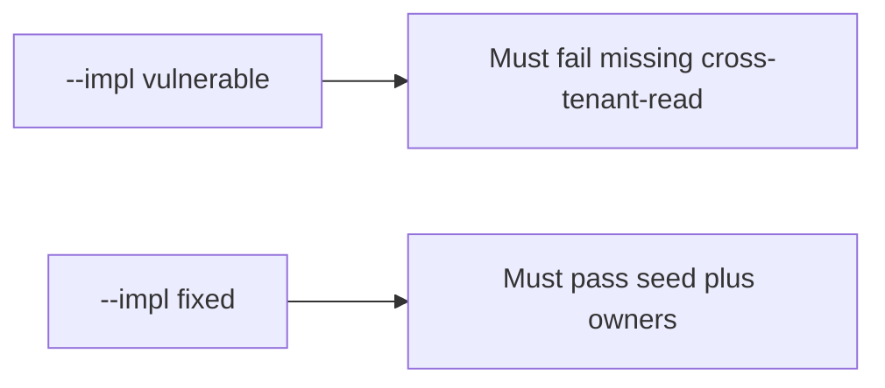

# 3.2-LO-05 — Evidence is a missing id, then a passing pair

**Kind:** verification-lab
**Loop step:** 5 Verify
**Standards:** OWASP ASVS 5.0.0 (final) `v5.0.0-15.1.3`. Appendix D is awareness, not this pair.

## An invariant that cannot fail a test is still a slogan

“We threat-modeled in the sprint” is not evidence. “Scanner was green” is a mechanism observation. The oracle is: `threats_from_scan(True)` contains `cross-tenant-read`. That observation must be **false** on `--impl vulnerable` and **true** on `--impl fixed`.

## Mental model: vulnerable must fail: missing cross-tenant-read

The failing observation on `--impl vulnerable` is **missing cross-tenant-read**. A passing collection count is not this cell.



| Mode | Must show for this module |
|---|---|
| Normal | After the fix, mandatory rows still have `owner` and `trigger` |
| Negative / abuse | Green scan still lists `cross-tenant-read`; vulnerable must fail that assertion |
| Additive | Scanner extras (`cve-extra`) do not replace the seed |
| Not claimed | Completeness of all future threats; production scanner SaaS; STRIDE facilitation quality |

Lab tests in `labs/3.2/3.2-lab/tests/test_property.py`. `test_green_scanner_is_not_an_empty_threat_model` is a **forbidden-outcome** test: an empty model on a green scan is not allowed to count as a passing control.

```text
python3 -m pytest labs/3.2/3.2-lab/tests --impl vulnerable
python3 -m pytest labs/3.2/3.2-lab/tests --impl fixed
```

Map each test to an LO-02 cell. If vulnerable does not fail the missing-id assertion, the lab is miswired—fix the wiring, not the assertion. An environment error is not security evidence.

## What the tests do not prove

- That STRIDE was facilitated well
- Webhook or SMS threats (transfer)
- That ASVS Appendix D is “compliant”
- Production scanner coverage
- That `stolen-worker` is implemented (7.4 is the later cell)

Record those as residuals or later modules, not as silent passes.

## Practice

Execute both implementations this session. Write the fail/pass pair next to the matrix row. Reject a “test” that only greps `STRIDE` in a markdown file without calling `threats_from_scan(True)`.

## Transfer

Clinic SMS. A test that only asserts HTTP 200 is not threat-model evidence (see 9.3). A test that scans a live clinic is out of scope.

## Non-goals

Do not add a live scanner tenant. Do not log note bodies. Keys stay out of this file.
