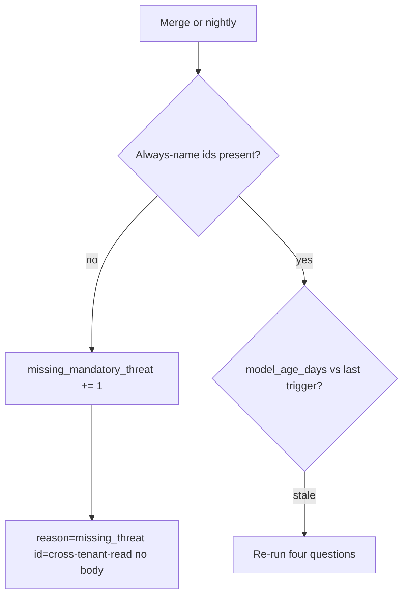

# Notice a missing id; do not pretend you already had it

**Kind:** operations-exercise
**Loop step:** 6 Operate

## Stopping it is not enough

A new share path, a worker, or a webhook can make the model stale while every CVE scanner stays green. Pair notice and recover. Do not log note bodies while you look. Do not back-date the threat-model file after an incident so it looks as if the row was always there.

## Picture: age and missing-id gates



A missing id is a notice-and-recover problem, not a licence to rewrite yesterday’s date. Notice names the threat. Recover adds the row. Neither pretends you already had it.

| Outcome | This topic |
|---|---|
| Notice | CI fails if required ids are missing; `model_age_days` after a named trigger |
| What the line holds | threat id, owner, trigger name; never the note body |
| Recover | Add the row, the tests, and an owner; **do not back-date** the file |
| Leftover | Unknown unknowns; write down the next trigger |

Industry lists talk about noticing, responding, and recovering. They do not pick a log product. They do not prove the seed. An awareness list is still awareness. Naming a SIEM product is not the rule.

## What the framework does vs what you still have to check

A scanner SaaS will page on new CVEs and stay silent on missing `cross-tenant-read`. That silence is this bug. Detection must ask the assembler, not the dashboard. If your alert pastes a note body or a patient SMS into the ticket, you have opened a classification leak.

## Practice

Write one log line you would accept. Tie it to `labs/3.2/3.2-lab`.

```text
log_denied reason=missing_mandatory_threat id=cross-tenant-read owner=authz request_id=req_32tm
```

Reject any line that includes a note body, a real email, a vendor scan PDF treated as the model, or “course gate complete.”

## Use it somewhere new

A clinic example: notice missing `sms-content-leak` after the reminder feature merges. Do not paste patient text into the ticket. Do not scan the clinic to prove the gap.

## What this page is not doing

Naming a product is not the rule. Answer keys are not on this site. Do not claim a course gate without learner or product evidence.
