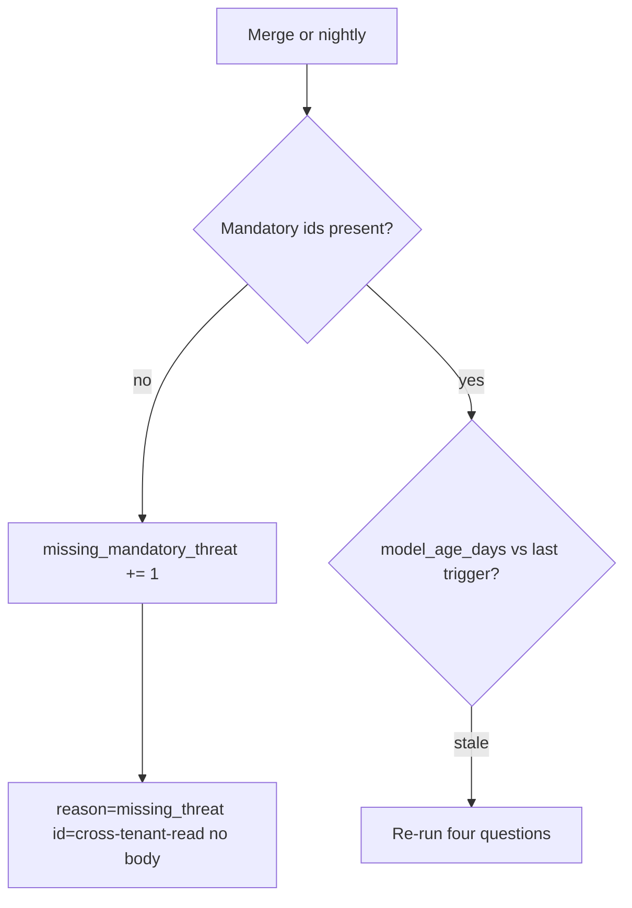

# 3.2-LO-06 — Detect a missing id; recover without back-dating

**Kind:** operations-exercise
**Loop step:** 6 Operate
**Standards:** NIST CSF 2.0 (final) DE/RS/RC as outcome labels; OWASP ASVS 5.0.0 (final) `v5.0.0-15.1.3`. CSF names outcomes; it does not prove the seed.

## Prevention is not absolute

A new share path, a worker, or a webhook can make the model stale while every CVE scanner stays green. Pair detect and recover. Do not log note bodies while investigating (3.1). Do not back-date the threat-model file after an incident so it looks as if the row was always there.

## Mental model: age and missing-id gates



| Outcome | This module |
|---|---|
| Detect | CI fails if required ids missing; `model_age_days` after a named trigger |
| Signal | threat id, owner, trigger name; never the note body |
| Recover | Add the row, tests, and owner; **do not back-date** the file |
| Residual | Unknown unknowns; document the next trigger |

CSF 2.0 Detect / Respond / Recover name *outcomes*. They do not prove ASVS. Appendix D is still awareness. A SIEM product name is not the property.

## Framework defaults versus the operate guarantee

A scanner SaaS will page on new CVEs and stay silent on missing `cross-tenant-read`. That silence is this bug. Detection must ask the assembler, not the dashboard. If your alert pastes a note body or a patient SMS into the ticket, you have opened a 3.1 cell.

## Practice

Write one log line you would accept. Tie it to `labs/3.2/3.2-lab`.

```text
log_denied reason=missing_mandatory_threat id=cross-tenant-read owner=authz request_id=req_32tm
```

Reject any line that includes a note body, a real email, a vendor scan PDF treated as the model, or “Gate 3 complete.”

## Transfer

Clinic: detect missing `sms-content-leak` after the reminder feature merges; do not paste patient text into the ticket. Do not scan the clinic to prove the gap.

## Non-goals

SIEM product names are not the property. Keys stay out of lessons. Gates 0–10 stay not-attempted without learner or product evidence.
