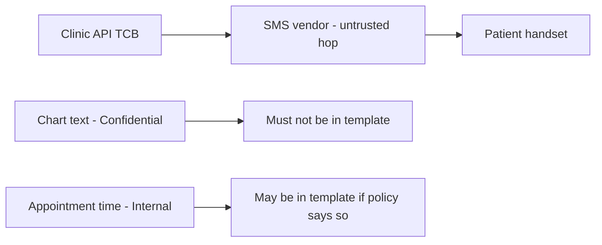

# 3.2-LO-07 — Transfer: clinic SMS reminders

**Kind:** transfer-challenge
**Loop step:** 7 Transfer
**Standards:** OWASP Threat Modeling Project (maintained) Four Questions; OWASP ASVS 5.0.0 (final) `v5.0.0-15.1.3`; NIST SP 800-154 IPD remains **draft**.

## Change the channel; keep scanner ≠ model

Do not answer with a Top 10 / CWE / scanner as the definition of security.

**Prompt:** Clinic SMS reminders — a new channel that Phase 1 HTTP scans will not enumerate.

**Product sketch:** EHR-lite booking card that texts “your appointment” to a phone number.

Rewrite the SecureCollab sentence. Include:

1. attacker capabilities (number-swap; SMS intercept on an untrusted hop; operator who pastes chart text into the template — not a live clinic);
2. trust assumptions (which assembler or markdown file is TCB; the SMS vendor is not);
3. forbidden outcome (empty model because “gateway questionnaire green,” or reminder body includes chart text — pick one and test it);
4. a test idea on a **local** fixture only;
5. residual (carrier logs; support read-aloud — 1.4);
6. WCAG 2.2 if a human-mediated control is in the claim (for example, a usable “opt out of SMS” path); SMS content classification itself is not a WCAG problem.

## Mental model: a new hop is a new question-one

Question two now includes content leak and number-swap even if every HTTP scanner is green. Seed those ids; do not wait for a CVE.

## What graders reject

| Reject | Why |
|---|---|
| Top 10 item as the property | 1.1 |
| “Vendor is HIPAA certified” as the model | Mechanism theater |
| Live clinic or real phone numbers | Lab policy |
| STRIDE letters without assets | Stickers |

## Practice

One page. No keys. `labs/3.2/3.2-lab` is the only running system you may break. You may also name webhook threats (7.3) as a second optional paragraph — still no live targets.
