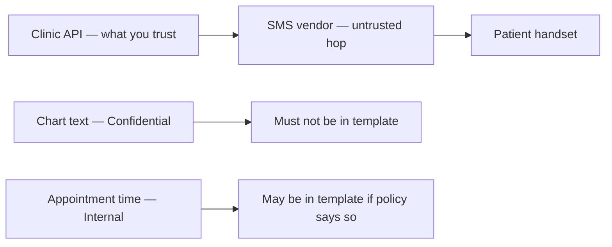

# Same idea on clinic SMS reminders

**Kind:** transfer-challenge
**Loop step:** 7 Transfer

## Use it somewhere new

You get **clinic SMS reminders** — a new channel that HTTP scans of the notes app will not enumerate. A green scan still lists `cross-tenant-read`.

Clinic SMS reminders — a new channel that HTTP scans will not enumerate.

An EHR-lite booking card that texts “your appointment” to a phone number.

1. who might try (number-swap; SMS intercept on an untrusted hop; an operator who pastes chart text into the template — **not** a live clinic, carrier, or public SMS API);
2. what you trust (which assembler or markdown file is the list you keep; the SMS vendor questionnaire is not);
3. what must not happen (empty model because “gateway questionnaire green,” or reminder body includes chart text — pick one and test it locally);
4. a check on a **local** practice only (`sms-content-leak` present when `scanner_green=True`);
5. leftover (carrier logs; support read-aloud; the data-centric modeling note is still a **draft**);
6. whether a human path must meet WCAG 2.2 (for example, a usable “opt out of SMS” path). SMS content classification itself is not an accessibility problem.

## Picture: a new hop is a new “what are we working on?”

Here, “reminder” is still “note” for this rule. Content leak and number-swap are new rows. A vendor sticker is still not what you trust.

Question two now includes content leak and number-swap even if every HTTP scanner is green. Seed those ids. Do not wait for a CVE. A vendor “HIPAA certified” sticker is theater, not the row.

## What is not good enough

| Reject | Why |
|---|---|
| A Top 10 item as the rule | Awareness, not the story of what you checked |
| “Vendor is HIPAA certified” as the model | Theater |
| Live clinic or real phone numbers | Course rules |
| STRIDE letters without assets | Stickers |
| The data-centric modeling note as a final baseline | Still a **draft** |

## Practice

Write one page. Leave the keys closed. `labs/3.2/3.2-lab` is the only running system you may break. You may also name webhook threats as a second optional paragraph — still no live targets.

## What this page is not doing

Do not try live-target scanning. Do not use real patient phone numbers. This page does not finish a check-in.
