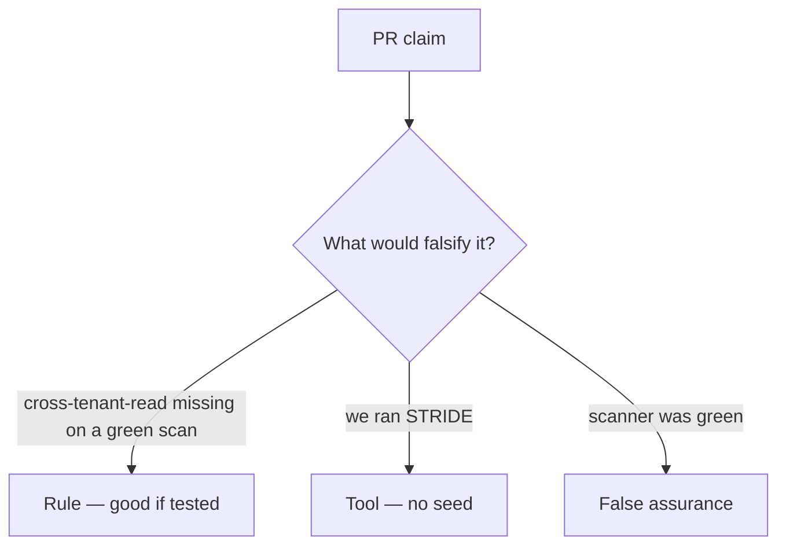

# Review of empty-model-on-green-scan

**Kind:** code-review
**Loop step:** Review

## What you are reviewing

Look at `labs/3.2/3.2-lab/vulnerable/` as a threat-list PR. Does `threats_from_scan(True)` still omit `cross-tenant-read`?

A TODO to threat-model later does not satisfy `test_green_scanner_is_not_an_empty_threat_model`.

## Picture: threats = [] if scanner_green

**threats = [] if `scanner_green`**.

The always-name id still has to be present on green. A scan-only change still ships an empty model.

## Problems to find (name them yourself)

- threats = [] if `scanner_green`
- No `cross-tenant-read` item
- Model not in version control (only a slide)
- STRIDE letters without assets, owners, or “what would prove this row wrong”

Also reject: treating the client as what you trust; an awareness list cited as a passing score; closing findings without re-running `test_green_scanner_is_not_an_empty_threat_model`; keys in learner notes; real personal data in the practice; a Top 10 as the threat list.

## Common mix-ups

- Green scan means no threats
- Threat models are pre-code only
- Awareness lists are the threat list
- Threat Dragon is the rule
- The data-centric modeling note (**draft**) is a verification list

## Use it somewhere new

A HIPAA sticker on SMS without seeding `sms-content-leak` still ships an empty model. What still has to be on the model so `cross-tenant-read` survives a green scan?

## What this page is not doing

Leave “will threat-model later” out of the merge until someone owns the always-name ids. Do not run a live scanner to prove the finding.
